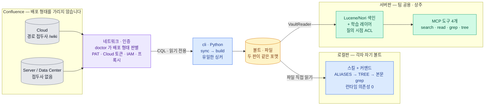
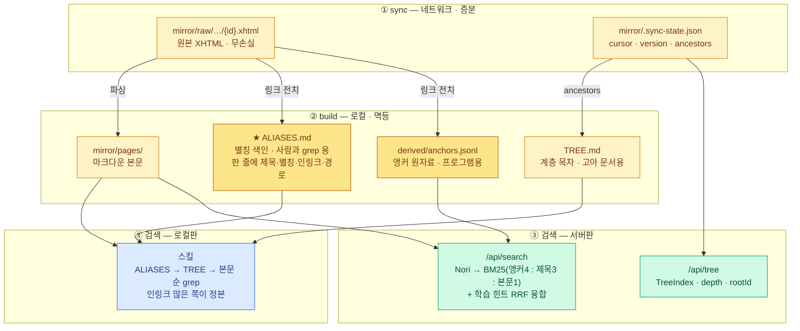
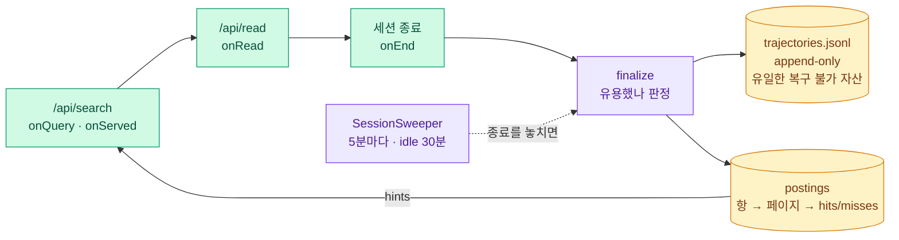

# WikiLens

**Confluence 를 에이전트가 다룰 수 있는 네 가지 연산으로 바꿉니다.**

에이전트는 위키를 못 읽습니다 — 인증이 필요하고, API 는 레이트리밋이 있고, 무엇보다
**grep 이 안 됩니다.** 그래서 "우리 배포 절차 문서 어디 있어?" 에 답할 수가 없습니다.

WikiLens 가 노출하는 것은 **연산 넷**입니다. 두 배포판이 같은 넷을 줍니다:

| 연산 | 무엇 | 로컬판 | 서버판 |
|---|---|---|---|
| **찾기** | 이름을 몰라도 후보를 찾습니다 | `ALIASES.md` grep | `search` (BM25 + 학습) |
| **읽기** | 본문을 마크다운으로 | 파일 `Read` | `read` (요청마다 ACL) |
| **본문 스캔** | 정확 일치 — 식별자·코드 조각 | `Grep` | `grep` (RE2) |
| **계층** | 이름은 몰라도 영역은 알 때 | `TREE.md` grep | `tree` |

**그것을 가능하게 하는 것이 미러**입니다 — 위키를 마크다운 파일로 받아둡니다. 로컬판은
그 미러가 내 디스크에 있어 오프라인에서도 돌고, 서버판은 서버에만 있어 사용자는
받지 않습니다(배포된 사본은 회수할 수 없어 권한 취소가 불가능해집니다).

**그 위에 랭킹 층을 얹습니다** — 앵커 텍스트 색인, 한국어 형태소 검색, 팀의 탐색 이력
학습. 셋 다 선택이고 각자 값어치를 증명해야 합니다(→ [무엇이 실제로 값어치를
하나](#무엇이-실제로-값어치를-하나)). 연산 넷은 그것 없이도 돕니다.

Claude Code 플러그인으로 설치하면 **어느 프로젝트에서든** 팀 위키에 물어볼 수 있습니다.

---

## TL;DR

**무엇** — 위키를 찾기·읽기·본문 스캔·계층 네 연산으로 노출합니다. 두 판이 같은
넷을 주고, 미러가 어디 있느냐로 갈립니다. 랭킹 층(앵커·형태소·학습)은 그 위의 선택입니다.

**어느 것을 쓰나** — 혼자거나 소규모 팀이면 로컬판, 여러 사람이 한 서버를 쓰면
서버판. 지금 배포한다면 로컬판입니다(서버판은 신원이 자기주장입니다 →
[미해결](#미해결)).

### 로컬판 실행 (각자, 5분)

Claude Code 안에서 세 줄입니다. **저장소를 clone 할 필요가 없습니다** — 마켓플레이스가
알아서 받아옵니다:

```
/plugin marketplace add https://github.com/cw-smart-catalogue/wikilens.git
/plugin install wikilens-local@wikilens
/wikilens-local:setup          # 자격증명·볼트·CLI·첫 싱크까지 한 번에
```

준비물은 **Confluence 주소와 개인 토큰(PAT)** 둘뿐입니다. 이미 볼트가 있으면 옮기지
말고 그 경로를 등록하면 됩니다.

<sub>저장소를 이미 clone 해 뒀고 그 사본으로 시험하려면 `/plugin marketplace add ./` 로
저장소 루트를 직접 가리켜도 됩니다. 고치면서 쓸 때만 그렇게 하세요 — 설치본이 저장소를
따라가지 않아 소스만 고치면 조용히 구버전이 돕니다.</sub>

### 서버판 실행 (관리자)

**사용자는 Confluence 자격증명이 필요 없습니다.** 서비스 계정 하나로 한 번 싱크합니다.

**전제 셋:** 아래 명령은 저장소 루트에서 돕니다(`compose.yml` 과 프록시 경로가
상대경로입니다). CLI 는 `~/.wikilens/venv` 에 깔려 **PATH 에 없습니다** — 아래처럼
절대경로로 부르거나 `WL=~/.wikilens/venv/bin/wikilens` 로 별칭을 잡으세요.

그리고 **볼트는 `~/.wikilens/vault` 입니다.** 로컬판·서버판·`compose.yml` 이 전부 이
자리를 기본으로 봅니다 — 지우는 방법이 `rm -rf ~/.wikilens` 하나로 유지되고, 서버가
`~/.wikilens/config.json` 의 `vault` 를 폴백으로 읽으므로 경로를 따로 알려줄 일도
없습니다(`DECISIONS.md` D15). 다른 자리에 두려면 `--root` 와
`--wikilens.vault-root` 를 **함께** 바꾸세요.

**권한 시행은 기본이 꺼짐입니다**(`acl-enforced=false`). 그래서 기본 구성에서는 **서버에
닿는 사람 전원이 서비스 계정의 권한 범위 전부를 봅니다.** 그래도 되는 팀이면 아래 세
단계가 전부이고, 아니면 [시행을 켜세요](#권한-시행을-켜려면).

```bash
cd <저장소 루트>
WL=~/.wikilens/venv/bin/wikilens        # 없으면: python3 -m venv ~/.wikilens/venv &&
                                        #         ~/.wikilens/venv/bin/pip install ./cli
export CONFLUENCE_URL=https://회사.atlassian.net CONFLUENCE_TOKEN=<서비스계정 PAT>
export WIKILENS_ADMIN_TOKEN=<임의의 긴 ASCII 문자열>

# 1. 볼트 만들기 — 호스트에서 합니다. 컨테이너는 싱크하지 않습니다.
#    스페이스 키는 Confluence URL 의 /spaces/<KEY>/ 자리이고, `$WL doctor` 도 목록을 냅니다.
$WL sync --space PLATFORM --root ~/.wikilens/vault

# 2. 서버 기동 — compose 기본값이 같은 자리라 볼트 경로를 안 줘도 됩니다
docker compose up -d --build

# 3. 확인 — 여기서 초록이 아니면 사용자는 "문서가 없다" 로 봅니다
WIKILENS_SERVER=http://localhost:8787 WIKILENS_USER=alice@corp \
  python3 plugin/client/mcp/wikilens_mcp.py --status
```

사용자는 플러그인만 설치합니다 — `/plugin install wikilens-client@wikilens` 후
`/wikilens-client:setup` 에 **서버 주소와 본인 식별자** 둘.

**3번이 중요한 이유** — 이 시스템의 실패는 대부분 **에러가 아니라 0건**으로 나타나고,
0건은 "문서가 없다" 와 구별되지 않습니다:

| 빠뜨리면 | 증상 | `--status` 가 하는 말 |
|---|---|---|
| `WIKILENS_ADMIN_TOKEN` | `/api/admin` 전부 404 | 기동 로그 WARN |
| 싱크 후 재색인 | 바뀐 문서가 반영 안 됨 | `ANALYZER` 불일치 등 |
| 볼트 경로가 틀림 | 검색은 되는데 **읽기만 404** | `docs>0` 인데 `pages=0` |
| (시행을 켰다면) 사용자 등록 | 모든 검색 0건 | `ACL_USERS=0` |
| (시행을 켰다면) 등록 토큰 ≠ 페이지 토큰 | 모든 검색 0건 | `ACL_TOKEN_OVERLAP=0` |

#### 권한 시행을 켜려면

**켜야 하는 경우는 이 서버에 닿는 사람들이 서비스 계정의 권한 범위를 공유하면 안 될
때**입니다. 켜면 등록 전까지 전원이 0건입니다(fail-closed).

**순서를 뒤집으면 전원이 0건이 됩니다** — 시행을 먼저 켜고 `["@public"]` 로 등록해 두면,
나중에 `wikilens acl` 이 페이지 토큰을 `@space:<KEY>` 로 바꾸는 순간 겹치는 토큰이
없어집니다. `--status` 가 `ACL_TOKEN_OVERLAP=0` 으로 짚습니다.

```bash
$WL acl --root ~/.wikilens/vault        # 권한 수집. sync 와 주기가 다릅니다
WIKILENS_ACL_ENFORCED=true docker compose up -d --build

# 사용자 등록 — 어떤 토큰을 줄지는 `wikilens acl` 출력의 토큰 목록이 알려줍니다
curl -XPOST -H "X-WikiLens-Admin: $WIKILENS_ADMIN_TOKEN" \
  'localhost:8787/api/admin/acl/user?userKey=alice@corp' \
  -H 'Content-Type: application/json' -d '["@space:PLATFORM"]'
```

**`wikilens acl` 은 시행이 꺼져 있어도 한 가지를 바꿉니다** — 수집이 권한을 확정하지
못한 페이지는 빈 토큰이 되어 **아무에게도 안 보입니다**(파이썬 쪽 fail-closed 를 여기서
뒤집지 않으려는 의도된 동작입니다). 돌린 뒤 문서가 줄었다면 원인은 시행이 아니라
수집 실패이고, 기동 로그의 `unresolved` 가 그 수를 냅니다.

**자동화는 cron 한 줄입니다.** `&&` 가 필수입니다 — 실패했는데 재색인하면 반쪽
상태가 반영됩니다:

```bash
WL=~/.wikilens/venv/bin/wikilens
$WL sync --root ~/.wikilens/vault \
  && curl -XPOST -H "X-WikiLens-Admin: $TOKEN" localhost:8787/api/admin/reindex

# 시행을 켰다면 acl 도 사이에 넣으세요 — sync 보다 자주 돌려야 합니다
# $WL sync --root ~/.wikilens/vault && $WL acl --root ~/.wikilens/vault && curl …
```

cron 에서는 **절대경로가 특히 중요합니다** — cron 의 PATH 는 대개 `/usr/bin:/bin`
입니다. 자격증명도 `export` 가 아니라 `~/.wikilens/env.sh`(600)에서 읽습니다.

**첫 싱크가 끝나면 `$WL stats` 를 보세요.** 그 수가 어느 랭킹 층이 값어치를
하는지 알려줍니다 — 코어(미러 + grep)는 어차피 돌지만, 앵커 층은 별칭이 있어야
일합니다. 이 개발 코퍼스(13,926건)에서는 별칭 보유 12% · 어휘 격차 1% 였습니다.
자세한 해석은 [무엇이 실제로 값어치를 하나](#무엇이-실제로-값어치를-하나).

---

**더 읽으실 분은** [어느 것을 쓰나요](#어느-것을-쓰나요) → [시작하기](#시작하기) 두 절이면
충분합니다. 그 아래는 만드는 사람을 위한 것입니다.

| | |
|---|---|
| [어느 것을 쓰나요](#어느-것을-쓰나요) | 로컬판과 서버판 — 어느 쪽이 내 상황인가 |
| [어떻게 동작하나](#어떻게-동작하나) | Confluence → 볼트 → 두 판으로 갈리는 흐름 |
| [시작하기](#시작하기) | [로컬판 5분](#로컬판--5분) · [서버판 운영자](#서버판--운영자) · [사이에 둘 한 단계](#사이에-한-단계를-두세요) |
| [학습 레이어](#학습-레이어-서버판만) | 서버판만 — 팀의 탐색 이력이 랭킹을 보정하는 방식 |
| [저장소 구조](#저장소-구조) | 어느 디렉터리가 무엇을 하나 |
| [적용 범위](#적용-범위) | Cloud·Server/DC 양쪽 · 언어는 한국어 기본 |
| [무엇이 실제로 값어치를 하나](#무엇이-실제로-값어치를-하나) | **층 넷을 각자 판정합니다** — 여기부터 읽어도 됩니다 |
| [만드는 사람을 위해](#만드는-사람을-위해) | [검증 절차](#변경-후-이것-하나가-통과해야-합니다) · [검증 상태](#검증-상태) · [측정 지표](#측정-지표--층마다-다릅니다) |
| [미해결](#미해결) | 아직 못 푼 것 — 배포 전에 읽으세요 |

---

## 어느 것을 쓰나요

**둘 다 코어는 같습니다** — 같은 볼트를 읽습니다. 갈리는 것은 어느 랭킹 층을
얹느냐이고, 그래서 업그레이드 경로가 아니라 서로 다른 물건입니다.

| | **로컬판** | **서버판** |
|---|---|---|
| 코어 (미러 + 파일 연산) | ✅ 같은 볼트 | ✅ 같은 볼트 |
| 계층 (`TREE.md`) | ✅ | ✅ |
| 앵커 (`ALIASES.md`) | ✅ grep | ✅ 색인 + 가중 |
| 형태소 검색 (BM25/Nori) | ❌ ripgrep 이라 언어 무관 | ✅ |
| 학습 (궤적) | ❌ 관측할 서버가 없음 | ✅ |
| 누구에게 | 혼자 · 소규모 팀 | 팀 배포 |
| 권한 | 내 토큰 = 내 범위 (**자동**) | 서버가 요청마다 확인 |
| 오프라인 | **가능** | 불가 |

**지금 팀에 배포한다면 로컬판입니다.** 서버판은 권한 수집까지 만들었지만 신원이
아직 자기주장이라(`userKey` 를 아무 값으로 적을 수 있습니다) 신뢰 경계 안에서만
쓸 수 있습니다 — 리버스 프록시(SSO)를 앞에 두면 풀립니다(→ [미해결](#미해결)).
로컬판의 대가는 Confluence 부하가 사용자 수에 비례하는 것이라 소규모 팀에 한합니다.

설치해서 쓰기만 한다면 여기서 멈추고 사용 안내로 가세요 —
[**로컬판**](plugin/local/README.md) · [서버판](plugin/client/README.md).
아래부터는 만드는 사람을 위한 것입니다.

---

## 어떻게 동작하나



읽는 법이 셋입니다.

- **색이 곧 구현 언어** — 파랑 Python(`cli`·로컬판), 초록 Kotlin(서버판), 노랑 파일.
- Confluence 는 Cloud 든 Server/DC 든 상관없습니다. `doctor` 가 배포 형태를 판별하고
  인증도 넷을 지원합니다 — PAT · Cloud API 토큰 · IAM OAuth2 · 리버스 프록시.
- 볼트를 만드는 것은 `cli` 하나입니다. 서버는 Confluence 를 크롤하지 않고
  그 결과를 읽기만 합니다. 두 판은 볼트에서 갈라져 그 뒤로 만나지 않습니다.



**`build` 는 같은 원자료로 두 벌을 냅니다** — 마크다운은 사람이 grep 하라고, JSON 계열은
프로그램이 색인하라고:

| 산출물 | 누가 읽나 |
|---|---|
| `ALIASES.md` · `TREE.md` | **로컬판만** — 사람과 grep 을 위한 형식 |
| `derived/anchors.jsonl` · `.sync-state.json` 의 `ancestors` | **서버판만** — 색인을 위한 형식 |
| `mirror/pages/` 의 본문 | 양쪽 다 |

그래서 **서버판은 두 마크다운 파일을 읽지 않습니다.** 앵커도 계층도 양쪽 다 갖고 있고,
같은 원본에서 나온 다른 산출물을 볼 뿐입니다.

`sync` 와 `build` 를 나눈 이유는 **제목→ID 해석 완전성**입니다. Confluence 링크는 대개
제목으로 대상을 가리키는데, 전부 받은 뒤 한 번에 파싱해야 해석이 완전해집니다(실측 94%).

서버판은 여기에 **학습 레이어**를 얹습니다 — 검색하고 읽은 궤적이 쌓여, 남들이 같은
질문으로 찾아간 문서가 위로 올라옵니다. 훅은 없습니다. 읽기가 서버를 거치므로
서버가 궤적을 직접 관측합니다.

---

## 시작하기

### 로컬판 — 5분

```
/plugin marketplace add https://github.com/cw-smart-catalogue/wikilens.git
/plugin install wikilens-local@wikilens
/wikilens-local:setup
```

`setup` 이 전부 합니다 — 자격증명을 `~/.wikilens/env.sh`(600)에 고정하고, 볼트 위치를
`~/.wikilens/config.json` 에 적고, CLI 를 `~/.wikilens/venv` 에 설치하고, 첫 싱크까지.
준비할 것은 **Confluence 주소와 개인 액세스 토큰(PAT)** 둘뿐입니다.
이미 볼트가 있으면 옮기지 말고 그 경로를 등록하면 됩니다.

싱크가 끝나면 `stats` 가 "제목과 어휘가 안 겹치는 별칭을 가진 페이지" 비율을 냅니다.
**여기서 판단하세요 — 낮으면 어휘 격차가 없다는 뜻이고, 이 도구 전체가 값어치가 없습니다.**

<details>
<summary><b>플러그인 없이 CLI 만</b> — cron·서버 운영자용</summary>

```bash
python3 -m venv ~/.wikilens/venv && ~/.wikilens/venv/bin/pip install ./cli

mkdir -p ~/.wikilens && chmod 700 ~/.wikilens
cat > ~/.wikilens/env.sh <<'EOF'
export CONFLUENCE_URL=https://confluence.mycompany.com
export CONFLUENCE_TOKEN=<개인 액세스 토큰>
EOF
chmod 600 ~/.wikilens/env.sh

~/.wikilens/venv/bin/wikilens doctor                       # 연결·인증·스페이스 확인
~/.wikilens/venv/bin/wikilens sync --space PLATFORM --root ~/.wikilens/vault   # 수 분
~/.wikilens/venv/bin/wikilens stats --root ~/.wikilens/vault
```

자격증명은 `export` 가 아니라 파일에 둡니다. `export` 는 그 셸에서만 살아서
Claude Code 를 앱으로 띄우면 없는 것과 같고, 실제로 **검색은 되는데 `sync` 만 조용히
죽는** 상태를 오래 겪었습니다(→ `DECISIONS.md` D10). CLI 는 환경변수가 없으면
이 파일을 읽습니다 — cron 에서도 그냥 동작합니다.

`--root` 는 서브커맨드 앞뒤 어디에 와도 되고, 플러그인을 통해 부르면 래퍼가
`~/.wikilens/config.json` 의 볼트 경로로 자동으로 채웁니다.

</details>

<details>
<summary><b>인증이 안 되면</b> — SSO · 게이트웨이 · 접두사 자동판별</summary>

**SSO 환경이어도 대개 PAT 가 따로 동작합니다.** Server/DC 의 PAT 를 먼저 시도하세요.
그것이 막혀 있을 때만 IAM OAuth2 가 필요합니다. 인증은 넷을 지원하고
(`CONFLUENCE_TOKEN` PAT · Cloud API 토큰 + `CONFLUENCE_EMAIL` · 자체 IAM OAuth2 ·
리버스 프록시 헤더 주입) 전부 `cli/wikilens/auth.py` 한 곳에 격리돼 있습니다.

**배포 형태를 잘못 판별하면** — `detect_prefix()` 가 Cloud(`/wiki`)와 Server/DC(빈 접두사)를
자동 판별합니다. 리버스 프록시가 일부 엔드포인트만 허용하는 구성에 속은 적이 있어
이중 검증을 넣었지만, 게이트웨이 구성은 조직마다 달라 또 속을 수 있습니다:

```bash
export CONFLUENCE_PREFIX=""        # Server/DC 강제
# export CONFLUENCE_PREFIX="/wiki" # Cloud 강제
```

**첫 번째로 의심할 자리는 아닙니다** — 이중 검증 이후로는 강제 지정 없이 동작하는 것을
실측했습니다(2026-08-06). 자격증명이 파일에 제대로 있는지를 먼저 보세요.

</details>

### 서버판 — 운영자

```bash
# 서비스 계정으로 1회 싱크 (사용자별 싱크 없음 → Confluence 부하 1배)
WL=~/.wikilens/venv/bin/wikilens          # CLI 는 PATH 에 없습니다
CONFLUENCE_TOKEN=<서비스계정> $WL sync --space PLATFORM --root ~/.wikilens/vault
CONFLUENCE_TOKEN=<서비스계정> $WL acl  --root ~/.wikilens/vault   # 시행을 켤 때만

# 권장 — Docker. 이미지가 ripgrep 을 갖고 있고 경로가 절대경로로 못 박혀 있습니다.
export WIKILENS_ADMIN_TOKEN=<임의의 긴 ASCII 문자열>
docker compose up -d --build   # compose 기본값이 ~/.wikilens/vault 입니다

# 또는 직접 — 기동 시 볼트를 찾아 전량 색인합니다
cd server && ./gradlew bootRun
```

**ACL 시행을 켰다면 등록 전까지 전원이 빈손입니다**(fail-closed, 기본은 꺼짐).
어떤 토큰을 줄지는 `wikilens acl` 출력의 토큰 목록이 알려줍니다:

```bash
curl -XPOST -H "X-WikiLens-Admin: $TOKEN" \
  'localhost:8787/api/admin/acl/user?userKey=alice@corp' \
  -H 'Content-Type: application/json' -d '["@space:PLATFORM"]'
```

사용자는 볼트를 받지 않습니다 — 플러그인만 설치하고 값 둘(`서버 주소`·`본인 식별자`)을
넣으면 됩니다: `/plugin install wikilens-client@wikilens` → `/wikilens-client:setup`.

| 설정 | 안 주면 | 어떻게 보이나 |
|---|---|---|
| 볼트 경로 | `~/.wikilens/config.json` 의 `vault` 를 읽습니다 — CLI 가 만든 볼트를 그대로 찾습니다 | 정상. 다른 자리면 `--wikilens.vault-root=/절대/경로`(**명시가 항상 이깁니다**) |
| 사용자의 `user` | 서버가 요청자를 식별 못 합니다 | **결과가 항상 빔** — "문서가 없다" 처럼 보입니다 |
| `WIKILENS_ADMIN_TOKEN` | `/api/admin` 이 전부 404 | 등록·재색인이 아예 안 됩니다 |

배포·운영 절차(cron 자동화 · ACL 등록 · 분석기 선택 · 백업 대상)는
[`server/README.md`](server/README.md).

### 사이에 한 단계를 두세요

로컬판에서 서버판으로 바로 가지 마세요. **서버를 혼자 띄워 궤적이 실제로 쌓이는지만**
먼저 봅니다 — 같은 서버지만 플러그인 배포가 없습니다:

```bash
cd server && ./gradlew bootRun
curl -XPOST localhost:8787/api/search -H 'Content-Type: application/json' \
  -d '{"query":"...","userKey":"me","sessionId":"t1"}'
curl localhost:8787/api/stats     # trajectories · termPagePairs 가 느는지
```

**측정할 것은 비링크 도달 비율과 질의 중복률.** 낮으면 학습 레이어가 링크 그래프의
복사본으로 퇴화하는 중이라 배포해봐야 얻는 게 없습니다.

이 순서는 **실패해도 산출물이 남게** 짜여 있습니다 — 1단계에서 멈춰도 볼트와 별칭
색인은 그대로 쓸 수 있습니다.

---

## 학습 레이어 (서버판만)

**"남들이 같은 질문으로 찾아간 문서"를 다음 사람에게 밀어 올립니다.** 어휘 검색이
못 찾은 것을 사람들의 탐색이 대신 찾아준 셈이니, 그 경로를 기억해 두는 것입니다.

**층 넷 중 가장 조건이 까다롭습니다.** 같은 질의가 반복돼야 하고, 서버가 있어야 하고,
사람이 여럿이어야 합니다(혼자서는 통계가 안 쌓입니다). 이 개발 코퍼스에서는 아직
궤적이 0 입니다 — 아래는 만들어 둔 것이지 검증된 것이 아닙니다.

### 관측 — 도구 호출이 곧 궤적입니다



| 안 만든 것 | 대신 | 왜 |
|---|---|---|
| 보고 도구(`record_trajectory`) | 검색·읽기 **자체를 관측** | 에이전트가 안정적으로 불러줄 리 없습니다 (D6) |
| 클라이언트 훅 | 서버가 직접 봄 | 읽기가 서버를 거칩니다 |
| 세션 경계 조립 | MCP 프록시 프로세스 하나 = 세션 하나 | 종료를 놓치면(SIGKILL·크래시) `SessionSweeper` 가 거둡니다 — **안 거두면 그 세션이 배운 것이 통째로 사라집니다** |

### 무엇을 기억하나

| | 값 | 왜 |
|---|---|---|
| 키 단위 | **항(term)** — 키워드 집합이 아님 | "로그인 붙이는 법 어디"와 "로그인 붙이는 법"이 다른 키가 되면 카운트가 흩어집니다 |
| 저장 형태 | `항 → 페이지 → (hits, misses)` | 같은 항에 목적지가 여럿인 건 경쟁이 아니라 **질의가 모호한 것**이라 분포로 둡니다 |
| 캐싱 대상 | `LOCALIZATION` 질의만 | "이 데이터가 어떻게 흐르나"에 목적지만 주면 답한 게 아니라 **답을 지운** 겁니다 |

`Gate.classify` 가 질의를 넷으로 나누고 **첫째만 간선을 만듭니다:**

| 종류 | 답이 어디 있나 | 간선 |
|---|---|---|
| `LOCALIZATION` | 목적지가 곧 답 | **만듭니다** |
| `TRACING` | 경로가 곧 답 | 안 만듭니다 — 목적지만 주면 답을 지운 것 |
| `RATIONALE` | 근거가 경유지에 분산 | 안 만듭니다 |
| `UNKNOWN` | 판단 보류 | 안 만듭니다 |

분포는 `/api/stats` 의 `byKind` 가 냅니다 — **UNKNOWN 이 아주 낮으면 게이트가 사실상
항등함수**라는 뜻이라, 그 수를 보기 전에는 이 분류가 일하는지 알 수 없습니다.

### 얼마나 믿나 — Empirical Bayes

Wilson 하한이 아닙니다. Wilson 은 카운트만 봐서 **같은 4승 3패라도 검색이 강하게
가리키는 후보와 겨우 걸린 후보를 구분하지 못합니다.**

```
prior = Beta(s·κ, (1−s)·κ)          s = 정규화된 Lucene 점수 · κ = 5
post  = Beta(s·κ + hits, (1−s)·κ + misses)
신뢰도 = 그 사후분포의 5% 하한
```

Wilson 은 **균등 사전분포의 특수한 경우**라, 검색 점수를 사전분포로 주면 그 정보가
살아납니다. 표본이 쌓이면 사전분포 영향은 저절로 사라집니다(400승 300패에서 격차 0.005).

사전확률은 `[0.05, 0.85]` 로 자릅니다 — 1.0 이면 Beta 한쪽 모수가 0이 되어
**관측 한 번에 신뢰도 1.0** 이 됩니다.

신뢰도가 **0.45 미만이면 서빙하지 않습니다.** 확신 없을 때 침묵하는 것이 이 설계의
전제입니다:

```
손익분기    p_hit · (n−1) > p_wrong
```

기준이 절대 적중률이 아니라 **적중 대 오답 비율**입니다. 캐시가 침묵하면 `p_wrong → 0`
이라 거의 항상 이득입니다 — `1/n` 은 틀린 공식입니다(D2).

### "유용했다"는 어떻게 아나 — 이 설계의 최대 미해결

서버는 무엇을 읽었는지만 보고 그게 답이었는지는 모릅니다. 신호 다섯을 씁니다:

| 신호 | 판정 |
|---|---|
| 마지막으로 읽은 페이지 | 답일 확률이 높다 — 탐색은 성공에서 멈춥니다 |
| 키워드가 겹치는 재질의 | 앞 시도는 실패였다 |
| **서빙했는데 끝내 안 읽힌 힌트** | 그 힌트가 틀렸다 — 유일하게 학습을 **되돌리는** 신호 |
| 마지막 읽기 앞의 것들 | 열어보고 지나쳤다 (1건이면 미스 0, 6건이면 5) |
| `dest` 의 검색 순위 | 깊을수록 강한 증거 (1위 ×1 · 2~3위 ×2 · 그 아래 ×3) |

셋째가 중요합니다. 그전에는 미스가 나는 경로가 재질의 하나뿐이라 **엉뚱한 힌트도
벌점이 없었고**, `pWrong` 이 늘 0.0 이었습니다.

**클릭 없는 종료를 실패로 세지 않습니다.** 결과 제목만 보고 답했을 수 있어서요 —
IR 에서 [good abandonment](https://dl.acm.org/doi/10.1145/1571941.1571951) 로 알려진
오독입니다. `abandonedWithHints` 로 따로 셉니다.

> **아직 재지 못한 것:** 순위 가중의 문턱(3·6)과 3배 상한은 손으로 정한 값입니다.
> 깊을수록 강하다는 방향만 웹 검색 클릭 모델에서 확립된 것이고, 이 코퍼스에서
> 측정하지 않았습니다. `dest = reads.last()` 라는 전제 자체도 그대로입니다.
> `/api/stats` 의 `pWrong` 과 `sinceStart` 로 모니터링하세요.

### 검색 결과에 어떻게 섞이나

어휘 순위와 학습 힌트를 RRF 로 융합하되, **힌트는 순위가 아니라 신뢰도로 가중**합니다 —
EB 하한은 이미 확률이라 순위로 뭉개면 보정된 정보를 버리게 됩니다.

```
어휘   1 / (60 + rank + 1)
학습   1.6 × 신뢰도 / (60 + rank + 1)
```

결과에 붙는 표시가 그것입니다. `*` 는 양쪽에서, `S` 는 학습에서만 나온 것입니다.
`S` 가 곧 **어휘 검색이 못 찾은 문서를 학습이 찾아낸 경우**이고, 이 레이어의 존재 이유입니다.

**권한 관문은 `hints()` 술어 하나입니다.** 학습 레이어는 권한을 모르므로 술어를 밖에서
받아 자르기 전에 거릅니다 — `take` 뒤에 거르면 서빙 못 할 후보가 슬롯을 먹어, 볼 수
있는 힌트가 아래에 있어도 안 나옵니다(같은 실패를 자리만 바꿔 세 번 겪었습니다).

---

## 저장소 구조

| 경로 | 내용 | 언어 |
|---|---|---|
| **`cli/`** | Confluence 싱크 · 파싱 · 앵커 전치 — **볼트를 만드는 유일한 곳** | Python |
| **`server/`** | Lucene/Nori 색인 · 학습 레이어 · HTTP API | Kotlin |
| **`plugin/local/`** | 스킬 + 커맨드 2개 ([사용 안내](plugin/local/README.md)) | Python |
| **`plugin/client/`** | MCP 도구 4개 + 스킬 ([사용 안내](plugin/client/README.md)) | Python |
| `contract/` | 교차 언어 계약 검사 + 공유 골든 픽스처 | — |
| `docs/` | [아키텍처](docs/architecture.md) · 임베딩 설계 제안 | — |
| `.claude-plugin/` | 마켓플레이스 매니페스트 (**반드시 저장소 루트**) | — |

Python 과 Kotlin 은 **파일로만** 연결됩니다. 볼트 포맷이 곧 인터페이스입니다.
그래서 한쪽만 바꾸면 에러 없이 조용히 틀어지고, `contract/shared_contract.sh` 가
그것을 막습니다.

[`DECISIONS.md`](DECISIONS.md) — 뒤집힌 결정과 지우면 안 되는 것들. **되돌리기 전에 읽으세요.**

---

## 적용 범위

**특정 회사에 묶여 있지 않습니다.** Confluence Cloud 와 Server/Data Center 양쪽,
인증 4방식을 지원합니다. Confluence 고유 개념(`ac:link` storage format · `ancestors` · CQL)
에만 의존하므로 어느 조직의 인스턴스든 같은 코드가 돕니다.

> 저장소 곳곳의 `Coway 2,383건` 같은 표기는 **측정 출처 라벨**입니다 — 그 수치가 어느
> 코퍼스에서 나왔는지 밝히는 것이지 종속이 아닙니다. 배포되는 플러그인·CLI 에는
> 회사 고유값이 없습니다.

**언어는 한국어를 기본으로 합니다.** 교착어라 조사가 붙어('로그인을/로그인은/로그인이')
형태소 분석 없이는 BM25 가 무너집니다 — 그것이 서버를 JVM 으로 고른 유일한 이유입니다.

**하나로 다 되지 않습니다.** 어느 쪽을 고르든 반대쪽을 잃습니다:

| | `korean`(Nori, 기본) | `english` | `standard` |
|---|---|---|---|
| 한국어 조사를 뗀다 | ✅ | ❌ | ❌ |
| 영문 어간을 줄인다 (`servers`→`server`) | ❌ | ✅ | ❌ |
| 영문을 깨뜨리지 않는다 | ✅ 자르고 소문자화 | ✅ | ✅ |
| 어느 언어도 망가뜨리지 않는다 | — | — | ✅ 대신 어느 쪽에도 최선은 아님 |

실측: 굴절 쌍 5개에서 Nori 0 · English 5. **한국어 문서에 `Jenkins`·`DEPLOY_TOKEN` 같은
영문 식별자가 섞인 코퍼스**라면 그것들이 굴절하지 않으므로 Nori 의 약점이 안 드러납니다.

영어가 주된 코퍼스라면 **색인할 때** 고르세요 — `--wikilens.analyzer=korean|english|standard`.
질의는 설정이 아니라 색인에 기록된 분석기를 따릅니다(안 그러면 설정이 낡았을 때
에러 없이 0건). 로컬판은 grep 이라 언어와 무관합니다.
자세한 것은 [`server/README.md`](server/README.md#분석기는-색인-시점에-고른다).

### 플랫폼

| | macOS · Linux · WSL | Windows |
|---|---|---|
| **서버판 사용자**(검색만) | 됩니다 | **됩니다** — 프록시가 순수 파이썬이라 셸이 필요 없습니다 |
| 서버 운영(sync·acl) | 됩니다 | **Git for Windows** 가 있으면 됩니다 |
| 로컬판 | 됩니다 | **Git for Windows** 가 있으면 됩니다 |

Claude Code 는 Git for Windows 가 있으면 **Git Bash 로 Bash 도구**를 쓰고, 없으면
PowerShell 도구를 씁니다(https://code.claude.com/docs/en/setup).
볼트를 *만드는* 경로(`wikilens_cli.sh` 래퍼, 자격증명
`~/.wikilens/env.sh`)가 셸 스크립트라, Bash 도구가 있어야 로컬판과 서버 운영이
됩니다. 검색만 하는 서버판 사용자는 해당 없습니다.

#### Windows 준비 (Git for Windows 있는 경우)

```powershell
# 1. Git for Windows — Claude Code 가 Bash 도구를 쓰게 해줍니다
winget install Git.Git

# 2. 파이썬 — 이름을 확인해 두세요 (python / python3 / py 중 무엇인지)
winget install Python.Python.3.12
python --version

# 3. MCP 프록시의 인터프리터 이름 (서버판만. `python3` 로 안 뜰 때)
setx WIKILENS_PYTHON python
```

설정 후 **Claude Code 를 재시작**하세요. 이후는 macOS·리눅스와 같습니다 —
래퍼가 `python3 → python → py -3` 순으로 알아서 찾습니다.

**알아둘 것 셋:**

- **줄바꿈.** `.gitattributes` 가 `.sh` 를 LF 로 고정합니다. 그전에 clone 한 저장소가
  있다면 `git rm --cached -r . && git reset --hard` 로 한 번 정규화하세요 —
  CRLF 로 받은 셸 스크립트는 `$'\r': command not found` 로 죽습니다.
- 홈 디렉터리. 래퍼는 `~/.wikilens/env.sh` 를 직접 조립하지 않고 파이썬에게
  물어봅니다. Git Bash 의 `$HOME` 과 파이썬의 `Path.home()`(=`USERPROFILE`)이 다를 수
  있어서입니다 — 회사 환경에서 홈 드라이브를 따로 잡아두면 실제로 갈립니다.
- 파일 권한. `env.sh` 는 토큰이 들어 `600` 으로 만들지만, NTFS 에서는 그 제한이
  실질적으로 걸리지 않습니다. 공용 PC 에서는 그 점을 감안하세요.

> **Windows 에서 실제로 돌려본 적은 없습니다.** 위는 코드가 무엇을 요구하는지와
> Claude Code 문서(https://code.claude.com/docs/en/setup)에서 온 것이지
> 실행 확인이 아닙니다 — 이 저장소의 다른 검증과 같은 급으로 읽지 마세요.

---

## 무엇이 실제로 값어치를 하나

**층이 넷이고 각자 조건이 다릅니다.** 코어는 코퍼스가 있으면 무조건 일하지만, 랭킹
층 셋은 코퍼스가 어떻게 생겼는지에 달려 있습니다 — 그래서 각자 재야 합니다.

| 층 | 무엇을 하나 | 일하는 조건 | 개발 코퍼스(13,926건) 실측 |
|---|---|---|---|
| **코어** — 미러 + 연산 넷 | 위키를 에이전트가 다룰 수 있게 만듭니다 | 코퍼스가 있으면 항상 | 13,926건 전부 |
| **계층** — `TREE.md` | 제목이 무정보일 때 부모가 맥락을 줍니다 | 계층이 깊고 제목이 약할 때 | 번호·날짜 제목 **45.5%**, 그중 **99.9%** 가 부모를 가짐 |
| **앵커** — `ALIASES.md` | 남들이 부르는 이름으로 찾습니다 | 문서끼리 링크가 많을 때 | 별칭 보유 **12%** · 어휘 격차 **1%** |
| **학습** — 궤적 (서버판) | 팀의 탐색 경로가 랭킹을 보정합니다 | 같은 질의가 반복될 때 | **아직 0** — 실사용 궤적이 쌓인 적 없음 |

**이 코퍼스에서는 계층이 앵커보다 넓게 작동합니다**(45.5% 대 12%). 인링크 중앙값이 0 이고
88%가 어디서도 링크되지 않은 고아라, 랭킹 층이 아예 안 닿는 문서가 대부분입니다 —
그 페이지들은 코어의 연산 넷(제목 검색 · 본문 스캔 · 계층)으로만 발견됩니다 —
로컬판이든 서버판이든 같습니다.

당신의 코퍼스는 다를 수 있습니다. `wikilens stats` 가 위 네 줄에 해당하는 수를 냅니다.

### 그래서 왜 이렇게 만들었나

**전부 "안 하면 무슨 일이 나는가" 로 정해졌습니다.** 되돌리기 전에 오른쪽 칸을 읽으세요.

| 결정 | 되돌리면 |
|---|---|
| **위키를 통째로 미러링한다** | 에이전트가 **grep 을 못 합니다.** API 는 인증·레이트리밋이 걸리고 부분 조회만 됩니다 — 코퍼스 전체를 훑는 질의가 성립하지 않습니다 |
| **앵커 텍스트를 색인한다** | 링크가 많은 코퍼스에서 정확도·토큰이 나빠집니다 (Brin & Page 1998, 신규 기법 아님). **링크가 적으면 이 층은 거의 안 일합니다** |
| **위키에 쓰지 않는다** | 사람 링크와 기계 링크가 섞여 **정답 신호가 영구히 오염**됩니다. 읽기 전용은 규율이 아니라 설계로 얻는 보장입니다 |
| **볼트를 클라이언트에 배포하지 않는다** | 배포된 사본은 **회수할 수 없어** 권한 취소가 불가능해집니다. 서버가 서빙하면 매 요청 ACL 이 걸립니다 |
| **서버가 색인을 갖는다** | Confluence 부하가 사용자 수에 비례하고(200명이면 200배), 사용자마다 랭킹 척도가 달라 **학습에 이질적 관측이 섞입니다** |
| **경로 의존 질의는 캐싱하지 않는다** | "이 데이터가 어떻게 흐르나" 에 목적지만 주면 답한 것이 아니라 **답을 지운 것**입니다 |
| **압축이 아니라 가산이다** | 무효화·폴백·출처 추적이 전부 원본 궤적에 의존합니다 — 궤적은 유일하게 복구 불가능한 자산입니다 |

자세한 근거는 [`docs/architecture.md`](docs/architecture.md), 기각된 안과 뒤집힌 결정의
이력은 [`DECISIONS.md`](DECISIONS.md).

---

## 만드는 사람을 위해

### 변경 후 이것 하나가 통과해야 합니다

```bash
./check.sh
```

계약(교차 언어) · pytest(cli+plugin) · MCP 프록시 · JUnit 넷을 돌리고 **한 줄로
판정**합니다. 종료 코드가 실패 개수입니다. 판정은 출력이 아니라 각 도구의 종료
코드로 합니다 — 예전에는 출력을 grep 해서 `BUILD FAILED` 한 줄이 묻힌 채 커밋된 적이
있습니다.

처음 clone 했다면 개발용 venv 부터 만들라고 `check.sh` 가 알려줍니다.
IntelliJ 의 **"3. 전체 검증"** 도 이것을 부릅니다. 볼트·색인·상태 기본값이 전부
`~/.wikilens/` 아래라 어떤 구성으로 띄우든 같은 자리를 씁니다.

작업 규율은 [`CLAUDE.md`](CLAUDE.md) 에 있습니다 — 절대 깨면 안 되는 계약,
조용히 실패하는 것들, 의도적으로 이상해 보이는 것.

### 검증 상태

| | 검증 |
|---|---|
| Python CLI · 앵커 전치 · 파서 | 통과 — 공유 골든 픽스처로 Kotlin 과 같은 산출물 대조 |
| Confluence 클라이언트 | 통과 — 가짜 서버로 Cloud/Server·429·페이지네이션·재개 |
| 인증 계층 (SSO/IAM) | 통과 — 가짜 IAM 으로 OAuth2·만료 갱신·401 재시도 |
| Kotlin 학습 레이어 (`learn/`) | JUnit 통과. 기대값 6개가 `scoring_reference.py` 산출과 1e-6 일치 |
| Kotlin 서비스 계층 | JUnit 통과 |
| Lucene/Spring 배선 | 빌드·bootRun·재색인 검증됨 (실데이터 13,921건) |
| Docker 기동 | 검증됨 — 볼트 마운트·ACL·검색·읽기·grep, `restart` 후 궤적·등록 유지 |
| 성능 측정 | 합성 볼트로 재현 (`GrepScaleTest`) — 실코퍼스 없이도 돕니다 |
| **검색 랭킹 품질** | **미검증** — 배선이 도는 것과 랭킹이 좋은 것은 다른 문제입니다 |
| **실사용 적중률** | **측정된 바 없음** |

**개수는 일부러 안 적습니다** — 늘 때마다 낡습니다. `./check.sh` 를 돌리면 나옵니다.

### 측정 지표 — 층마다 다릅니다

**"낮으면 그 층을 끈다" 로 읽습니다.** 코어는 판정 대상이 아닙니다 — 코퍼스가 있으면
일합니다. 아래는 랭킹 층 셋의 판정 기준입니다.

| 층 | 지표 | 낮으면 |
|---|---|---|
| 앵커 | 제목과 다른 별칭 비율 | 앵커 색인을 **안 써도 됩니다**. 코어와 계층은 그대로 돕니다 |
| 계층 | 제목 무정보율 × 부모 보유율 | `TREE.md` 가 줄 맥락이 없습니다 |
| 학습 | 비링크 도달 비율 | 링크 그래프의 **복사본으로 퇴화** — 앵커가 이미 하는 일을 반복합니다 |
| 학습 | **`pWrong`** | 손익분기 `p_hit > p_wrong/(n−1)` 의 분자 — **적중률보다 이것이 기준** |
| 학습 | 적중당 절약 대 미스당 검증 오버헤드 | 학습 레이어를 끄는 편이 낫습니다 |

**층을 끄는 것이 실패가 아닙니다.** 코퍼스마다 어느 층이 일할지가 다르고, 이 설계는
그것을 전제로 나뉘어 있습니다 — 로컬판이 곧 "코어 + 앵커·계층" 이고 학습은 서버판에만
있습니다.

---

## 미해결

**전부 서버판입니다.** 로컬판은 개인 토큰이 곧 권한 범위라 이 넷이 성립하지 않습니다.

| 미해결 | 지금 상태 | 풀리는 조건 |
|---|---|---|
| **`userKey` 가 자기주장** | 프록시가 설정의 `user` 를 그대로 보냅니다 | 리버스 프록시(SSO)가 헤더로 신원 주입. 공유 토큰은 그 아래 깔리는 바닥입니다(D18) |
| **사람 쪽 권한을 손으로 유지** | 페이지 권한은 `wikilens acl` 이 따라갑니다. "누가 어느 스페이스를 보는가" 만 운영자가 등록합니다 | 없음 — 사람이 늘거나 그룹 이동이 잦은 팀에는 **이 방식이 안 맞습니다** |
| **"유용했다" 판정** | 신호 다섯(마지막 읽기 · 질의 재구성 · **서빙했는데 안 읽힌 힌트** · 지나친 읽기 · `dest` 순위) | 실사용 궤적 축적 후 `pWrong` 판독 |
| **질의 원문이 서버로 감** | 콘텐츠는 아닙니다 | 없음 — 질의어 자체가 민감할 수 있습니다 |

**둘째가 가장 위험합니다** — Confluence 에서 그룹이 바뀌어도 모르고, 빠져도 운영자가
지울 때까지 계속 보입니다. 낡는 방향이 "덜 보임" 이 아니라 "더 보임" 입니다.

**셋째의 신호 중 "안 읽힌 힌트" 만 학습을 되돌립니다.** 나머지 넷은 강화만 하므로,
그것을 빼면 `pWrong` 이 영원히 0 입니다. `dest = reads.last()` 라는 전제 자체는 그대로입니다.

이미 만든 것: `wikilens acl` 이 권한을 수집하고(상속까지 직접 풉니다), `/api/admin`
하위가 공유 토큰으로 잠깁니다(**기본이 잠김**, 엔드포인트마다가 아니라 경로로).
권한 변경이 `lastModified` 를 안 건드리는 문제는 `acl` 을 `sync` 와 분리해 더 자주
돌리는 것으로 다룹니다.
