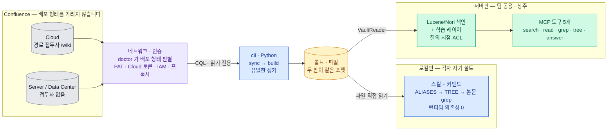
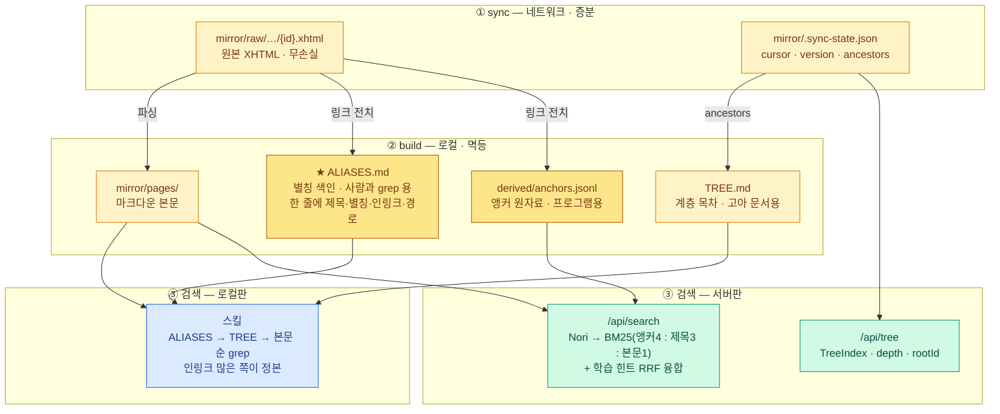

# WikiLens

<!--
  배지는 **정적**이다 — CI 가 없어 빌드 상태를 가리킬 대상이 없다(검증은 `./check.sh`
  하나이고 로컬에서 돈다). 여기 적힌 버전은 손으로 복제한 값이고, 정본은
  `server/build.gradle.kts` 와 `cli/pyproject.toml` 이다. **어긋나면 `shared_contract.sh` 가 빨개진다** — 이 저장소가
  "두 곳이 같아야 하는데 연결이 없다" 로 반복해서 물린 자리라 검사를 붙였다.

  **개수는 배지에 넣지 않는다**(계약 N개·테스트 N개). 늘 때마다 낡고, 돌리면 바로 나온다.

  **여섯이다.** 한때 열이었는데 넷은 스펙 요약이 아니었다 — `RE2` 는 결정(D12)이고,
  `MCP` 는 Claude Code 배지에 이미 함축돼 있고, `Confluence 읽기 전용` 은 스펙이 아니라
  **주장**이라 본문과 `CLAUDE.md` 가 훨씬 강하게 말한다. `Nori` 는 Lucene 에 합쳤다.
  배지가 늘면 각각이 덜 읽힌다.
-->

[](cli/)
[](server/)
[](server/build.gradle.kts)
[](server/)
[](#적용-범위)
[](#어느-것을-쓰나요)

**Confluence 를 에이전트가 다룰 수 있는 연산 넷으로 바꿉니다.**

에이전트는 위키를 읽기 어렵습니다. 인증이 필요하고, API 는 레이트리밋이 있고,
무엇보다 **grep 이 안 됩니다.**

그래서 "우리 배포 절차 문서 어디 있어?" 에 답할 수가 없습니다.

설치하면 이렇게 됩니다. Claude Code 안에서 평소처럼 물어보면 됩니다.

```bash
› 우리 배포 절차 문서 어디 있어?

  search("배포 절차")
  3건 (어휘 후보 24 · 학습 힌트 1)

  * 1. [200001001] 릴리스 파이프라인 운영 가이드  (PLATFORM) rel=0.74
    2. [200001042] 배포 체크리스트                (PLATFORM)
  S 3. [200001107] 롤백 절차                      (SRE)

  read(200001001)

› 릴리스 파이프라인 운영 가이드(PLATFORM)에 있습니다. 요약하면 —
  ① 태그를 올리면 CI 가 스테이징에 배포하고 ② QA 승인 후 …
```

**제목에 "배포 절차" 가 없어도 찾습니다.** 다른 문서들이 그 페이지를 링크할 때 쓴
표현(앵커 텍스트)을 함께 색인하기 때문입니다 — 사람들이 부르는 이름과 문서 제목은
대개 다릅니다.

<sub>`*` 는 어휘 검색과 팀의 탐색 이력 양쪽에서 나온 것, `S` 는 이력에서만 나온 것,
`rel` 은 과거에 이 질의로 이 문서가 유용했던 정도입니다. 위 화면은 형식을 보이려고
지어낸 예이고, 실제 문서·ID 는 당신의 위키 것입니다.</sub>

WikiLens 는 그 위키를 **연산 넷**으로 노출합니다. 두 배포판이 같은 넷을 줍니다.

| 연산 | 무엇 | 로컬판 | 서버판 |
|---|---|---|---|
| **찾기** | 이름을 몰라도 후보를 찾습니다 | `ALIASES.md` grep | `search` (BM25 + 학습) |
| **읽기** | 본문을 마크다운으로 | 파일 `Read` | `read` (요청마다 ACL) |
| **본문 스캔** | 정확 일치 — 식별자·코드 조각 | `Grep` | `grep` (RE2) |
| **계층** | 이름은 몰라도 영역은 알 때 | `TREE.md` grep | `tree` |

이 넷을 가능하게 하는 것이 **미러**입니다. 위키를 마크다운 파일로 통째로 받아둡니다.

로컬판은 그 미러가 내 디스크에 있어 오프라인에서도 돌고, 서버판은 서버에만 있어
사용자는 받지 않습니다. 배포된 사본은 회수할 수 없어 권한 취소가 불가능해지기 때문입니다.

그 위에 **랭킹 층**을 얹습니다. 앵커 텍스트 색인 · 한국어 형태소 검색 · 팀의 탐색 이력
학습, 이렇게 셋입니다.

셋 다 선택 사항이고 각자 값어치를 증명해야 합니다
(→ [무엇이 실제로 값어치를 하나](#무엇이-실제로-값어치를-하나)).

Claude Code 플러그인으로 설치하면 어느 프로젝트에서든 팀 위키에 물어볼 수 있습니다.
혼자거나 소규모 팀이면 **로컬판**, 여러 사람이 한 서버를 쓰면 **서버판**입니다.

### 이 문서에서 쓰는 말

| 용어                       | 의미                                                      |
|--------------------------|---------------------------------------------------------|
| **볼트 (Vault)**           | 미러가 놓인 디렉터리. 문서에서 미러와 거의 같은 뜻으로 씁니다 (기본값 `~/.wikilens`) |
| **코어**                   | 미러 + 위 연산 넷. 랭킹 층 없이도 도는 부분입니다                          |
| **랭킹 층**                 | 코어 위에 얹는 선택 셋 — 앵커 · 형태소 검색 · 학습                        |
| **앵커 (Anchor)**          | 다른 문서가 이 페이지를 링크할 때 쓴 표현. 이 도구의 핵심 신호입니다                |
| **궤적 (Trajectory)**      | 누가 무엇을 검색해 무엇을 읽었는지의 기록. 서버판에서만 쌓입니다                    |

## 목차

### 도입 · 시작

설치만 필요하면 1~2 로 충분합니다.

1. [어느 것을 쓰나요](#어느-것을-쓰나요) — 로컬판·서버판 비교와 선택 기준
2. [시작하기](#시작하기) — [로컬판 3줄](#로컬판--5분) · [서버판 사용자 3줄](#서버판--사용자) ·
   [서버판 구축](#서버판--운영자) · [전환 전 확인](#서버판으로-넘어가기-전-확인)

### 설계

3. [어떻게 동작하나](#어떻게-동작하나) — Confluence → 볼트 → 두 판의 분기
4. [학습 레이어](#학습-레이어-서버판만) — 탐색 이력에 의한 랭킹 보정. 서버판 한정
   (상세: [`docs/learning-layer.md`](docs/learning-layer.md))
5. [적용 범위](#적용-범위) — Confluence 배포 형태 · 언어 · 플랫폼
   (상세: [`docs/scope.md`](docs/scope.md))

### 판정과 개발

6. [무엇이 실제로 값어치를 하나](#무엇이-실제로-값어치를-하나) — 층 넷의 판정 기준
7. [저장소 구조](#저장소-구조) — 디렉터리별 역할
8. [만드는 사람을 위해](#만드는-사람을-위해) — [검증 절차](#변경-후-이것-하나가-통과해야-합니다) ·
   [검증 상태](#검증-상태) · [측정 지표](#측정-지표--층마다-다릅니다)
9. [미해결](#미해결) — 남은 문제와 배포 전 확인 사항
10. [기여](#기여) — 가장 도움이 되는 것 · 아직 안 밟힌 곳

---

## 어느 것을 쓰나요

둘 다 코어는 같습니다. 같은 볼트를 읽습니다.

갈리는 것은 어느 랭킹 층을 얹느냐뿐입니다. 그래서 업그레이드 경로가 아니라
**서로 다른 물건**입니다.

| | **로컬판** | **서버판** |
|---|---|---|
| 코어 (미러 + 파일 연산) | ✅ 같은 볼트 | ✅ 같은 볼트 |
| 계층 (`TREE.md`) | ✅ | ✅ |
| 앵커 (`ALIASES.md`) | ✅ grep | ✅ 색인 + 가중 |
| 형태소 검색 (BM25/Nori) | ❌ ripgrep 이라 언어 무관 | ✅ |
| 학습 (궤적) | ❌ 관측할 서버가 없음 | ✅ |
| 누구에게 | 혼자 · 소규모 팀 | 팀 배포 |
| 권한 | 내 토큰 = 내 범위 (**자동**) | 서버가 요청마다 확인 |
| 오프라인 | **가능** | 불가 |

지금 팀에 배포한다면 로컬판입니다.

서버판은 권한 수집까지 만들었지만 신원이 아직 자기주장이라
(`userKey` 를 아무 값으로 적을 수 있습니다) 신뢰 경계 안에서만 쓸 수 있습니다.
리버스 프록시(SSO)를 앞에 두면 풀립니다 (→ [미해결](#미해결)).

로컬판의 대가는 Confluence 부하가 사용자 수에 비례하는 것이라 소규모 팀에 한합니다.

정했으면 [시작하기](#시작하기) 로 가세요. 설치를 이미 마쳤고 쓰는 법만 필요하다면
사용 안내가 따로 있습니다 — [로컬판](plugin/local/README.md) ·
[서버판](plugin/client/README.md).

---

## 시작하기

**당신은 셋 중 누구입니까.** 대부분은 첫째나 둘째이고, 둘 다 두세 줄로 끝납니다.

| | 무엇을 하나 | 어디로 |
|---|---|---|
| **혼자 / 소규모 팀** | 내 토큰으로 내 볼트를 만듭니다 | [로컬판 — 3줄](#로컬판--5분) |
| **팀이 세운 서버를 씁니다** | 볼트를 안 받습니다. 주소와 식별자만 | [서버판 사용자 — 3줄](#서버판--사용자) |
| **그 서버를 세웁니다** | 도커·싱크·권한 | [서버판 운영자](#서버판--운영자) |

### 로컬판 — 5분

Claude Code 안에서 **세 줄**입니다.

저장소를 clone 할 필요가 없습니다. 마켓플레이스가 알아서 받아옵니다.

```bash
/plugin marketplace add https://github.com/mukansei/wikilens.git
/plugin install wikilens-local@wikilens
/wikilens-local:setup          # 자격증명·볼트·CLI·첫 싱크까지 한 번에
```

준비물은 셋입니다.

| | |
|---|---|
| Confluence 주소 | |
| 개인 액세스 토큰(PAT) | 없으면 `setup` 이 발급처를 안내합니다 |
| Claude Code | 마켓플레이스가 공개라 별도 인증이 필요 없습니다 |

나머지는 `setup` 이 합니다.

- 자격증명을 `~/.wikilens/env.sh` (600) 에 고정
- 볼트 위치를 `~/.wikilens/config.json` 에 기록
- CLI 를 `~/.wikilens/venv` 에 설치
- 첫 싱크까지 실행

**이미 볼트가 있으면 옮기지 말고 그 경로를 등록하면 됩니다.**

> 저장소를 이미 clone 해 뒀고 그 사본으로 시험하려면 `/plugin marketplace add ./` 로
> 저장소 루트를 직접 가리켜도 됩니다. **고치면서 쓸 때만** 그렇게 하세요.
> 설치본이 저장소를 따라가지 않아, 소스만 고치면 조용히 구버전이 돕니다.

첫 싱크는 스페이스 하나에 수천 페이지면 **수 분**이 걸립니다.

한 번만 하면 되고, 중단돼도 다음에 이어받습니다.

#### 끝나면 값어치부터 재세요

`stats` 가 "제목과 어휘가 안 겹치는 별칭을 가진 페이지" 비율을 냅니다.

**낮으면 어휘 격차가 없다는 뜻이고, 그러면 앵커 층은 값어치가 없습니다.**
코어(미러 + grep)와 계층은 그대로 돕니다.

이 개발 코퍼스(13,933건)의 실측은 인링크 보유 12% · **그중 별칭 보유 3%** ·
어휘 격차 1% 였습니다. 층별 판정 기준은
[무엇이 실제로 값어치를 하나](#무엇이-실제로-값어치를-하나) 에 있습니다.

#### 그리고 갱신을 걸어두세요

볼트는 매일 낡습니다. 손으로 하면 잊고, **낡은 답은 틀린 티가 안 납니다.**

```bash
crontab -e
# 0 9 * * 1 ~/.wikilens/venv/bin/wikilens sync --space PLATFORM --root ~/.wikilens/vault
```

`setup` 이 마지막에 이걸 물어보므로 대개 직접 할 일은 없습니다. CLI 가 자격증명을
`~/.wikilens/env.sh` 에서 읽으므로 cron 에 넘길 것이 없습니다.

**플러그인 래퍼가 아니라 CLI 를 직접 부릅니다.** 래퍼 경로에는 버전 번호가 들어
있어서(`…/wikilens-local/0.17.5/…`) 플러그인을 올리면 cron 이 조용히 깨집니다.
`~/.wikilens/venv` 는 버전과 무관한 자리입니다 (→ `DECISIONS.md` D15).

주 1회면 충분합니다 — 7일이 지나야 스킬이 "낡았다" 고 말하므로, 그 전에 갱신됩니다.

<details>
<summary><b>플러그인 없이 CLI 만</b> — cron·서버 운영자용</summary>

```bash
git clone https://github.com/mukansei/wikilens.git && cd wikilens
python3 -m venv ~/.wikilens/venv && ~/.wikilens/venv/bin/pip install ./cli

mkdir -p ~/.wikilens && chmod 700 ~/.wikilens
cat > ~/.wikilens/env.sh <<'EOF'
export CONFLUENCE_URL=https://confluence.mycompany.com
export CONFLUENCE_TOKEN=<개인 액세스 토큰>
EOF
chmod 600 ~/.wikilens/env.sh

~/.wikilens/venv/bin/wikilens doctor                       # 연결·인증·스페이스 확인
~/.wikilens/venv/bin/wikilens sync --space PLATFORM --root ~/.wikilens/vault   # 수 분
~/.wikilens/venv/bin/wikilens stats --root ~/.wikilens/vault
```

자격증명은 `export` 가 아니라 파일에 둡니다.

`export` 는 그 셸에서만 살아서, Claude Code 를 앱으로 띄우면 없는 것과 같습니다.
실제로 **검색은 되는데 `sync` 만 조용히 죽는** 상태를 오래 겪었습니다 (→ `DECISIONS.md` D10).

CLI 는 환경변수가 없으면 이 파일을 읽습니다. cron 에서도 그냥 동작합니다.

`--root` 는 서브커맨드 앞뒤 어디에 와도 됩니다. 플러그인을 통해 부르면 래퍼가
`~/.wikilens/config.json` 의 볼트 경로로 자동으로 채웁니다.

</details>

<details>
<summary><b>인증이 안 되면</b> — SSO · 게이트웨이 · 접두사 자동판별</summary>

SSO 환경이어도 대개 PAT 가 따로 동작합니다.

Server/DC 의 PAT 를 먼저 시도하세요. 그것이 막혀 있을 때만 IAM OAuth2 가 필요합니다.

인증은 넷을 지원하고, 전부 `cli/wikilens/auth.py` 한 곳에 격리돼 있습니다 —
`CONFLUENCE_TOKEN` PAT · Cloud API 토큰 + `CONFLUENCE_EMAIL` · 자체 IAM OAuth2 ·
리버스 프록시 헤더 주입.

배포 형태를 잘못 판별했을 때. `detect_prefix()` 가 Cloud(`/wiki`)와
Server/DC(빈 접두사)를 자동 판별합니다.

리버스 프록시가 일부 엔드포인트만 허용하는 구성에 속은 적이 있어 이중 검증을 넣었습니다.
다만 게이트웨이 구성은 조직마다 달라 또 속을 수 있습니다.

```bash
export CONFLUENCE_PREFIX=""        # Server/DC 강제
# export CONFLUENCE_PREFIX="/wiki" # Cloud 강제
```

첫 번째로 의심할 자리는 아닙니다. 이중 검증 이후로는 강제 지정 없이 동작하는 것을
실측했습니다 (2026-08-06).

자격증명이 파일에 제대로 있는지를 먼저 보세요.

</details>

### 서버판 — 사용자

운영자가 서버를 이미 세웠다면 **세 줄**입니다.

볼트를 받지 않고, 값 둘(**서버 주소**·**본인 식별자**)만 넣으면 됩니다 — 둘 다
운영자에게 받습니다.

```bash
/plugin marketplace add https://github.com/mukansei/wikilens.git
/plugin install wikilens-client@wikilens
/wikilens-client:setup
```

**마켓플레이스 등록이 첫 줄입니다** — 그게 없으면 `install` 이 플러그인을 못 찾습니다.

**식별자를 빼먹으면 결과가 항상 빕니다.** 서버가 요청자를 식별하지 못하기 때문입니다.

사용자에게는 "문서가 없다" 처럼 보이므로, 도구가 그 경우를 따로 알려줍니다.

서버를 세우는 쪽이라면 [서버판 — 운영자](#서버판--운영자) 로 가세요.

### 서버판 — 운영자

사용자는 Confluence 자격증명이 필요 없습니다. 서비스 계정 하나로 한 번 싱크하고,
사용자는 플러그인만 설치합니다.

그래서 **Confluence 부하가 1배**입니다. 로컬판은 사용자 수에 비례합니다.

먼저 알아둘 것 셋입니다.

| 전제 | 왜 |
|---|---|
| **운영자는 저장소가 필요합니다** | **이미지가 배포된 곳이 없어** 직접 빌드해야 하고, `compose.yml`·MCP 프록시도 저장소 안에 있습니다. 사용자는 플러그인만 설치하므로 해당 없습니다 |
| **파이썬은 필요 없습니다** | 볼트를 만드는 CLI 가 이미지 안에 있습니다. 마지막 확인 단계만 파이썬을 쓰는데 표준 라이브러리뿐이고 3.9 면 됩니다(macOS 기본) |
| **볼트는 `~/.wikilens/vault` 입니다** | 로컬판·서버판·`compose.yml` 이 전부 이 자리를 기본으로 봅니다. 옮기지 않는 편이 낫습니다 (아래 참고) |

<sub>볼트를 기본 자리에 두면 지우는 방법이 `rm -rf ~/.wikilens` 하나로 유지되고,
서버가 `config.json` 의 `vault` 를 폴백으로 읽어 경로를 따로 알려줄 일도 없습니다
(`DECISIONS.md` D15). 다른 자리에 두려면 `--root` 와 `--wikilens.vault-root` 를
**함께** 바꾸세요 — **명시가 항상 폴백을 이깁니다.**</sub>

> **권한 시행은 기본이 꺼짐입니다**(`acl-enforced=false`). 그래서 기본 구성에서는
> **서버에 닿는 사람 전원이 서비스 계정의 권한 범위 전부를 봅니다.** 그래도 되는 팀이면
> 아래 네 단계가 전부이고, 아니면 [시행을 켜세요](docs/server-operations.md#권한-시행을-켜려면).

```bash
git clone https://github.com/mukansei/wikilens.git && cd wikilens
./server/wikilens-setup.sh
```

**한 번 물어보고 나머지를 합니다** — 이미지 빌드 · 자격증명 저장 · 스페이스 목록에서
고르기 · 싱크 · 기동 · 확인까지. 값 다섯을 외우지 않아도 됩니다.

<details>
<summary><b>손으로 하려면</b> — 스크립트가 무엇을 하는지</summary>

```bash
# 1. 이미지 — **배포된 곳이 없어 직접 빌드합니다.** --no-cache 로 88초.
docker compose build
IMAGE=$(docker compose config --images | head -1)   # 이름은 <디렉터리>-wikilens 입니다

# 2. 볼트 — **파이썬도 CLI 도 안 깝니다.** 이미지가 CLI 를 갖고 있습니다.
#    스페이스 키를 모르면 sync 대신 doctor 를 주면 목록이 나옵니다.
docker run --rm \
  -e CONFLUENCE_URL=https://회사.atlassian.net -e CONFLUENCE_TOKEN=<서비스계정 PAT> \
  -v ~/.wikilens/vault:/vault \
  "$IMAGE" sync --root /vault --space PLATFORM

#    **자격증명은 이때만 줍니다.** 서버로 뜨는 컨테이너에는 안 들어갑니다.
#    **키가 틀리면 "싱크 완료" 로 끝나고 페이지가 0건입니다** — 스크립트는 그것을 셉니다.

# 3. 기동 — 마운트는 `~/.wikilens` 한 줄입니다
docker compose up -d
#    포트를 바꾸려면 WIKILENS_PORT · 언어를 바꾸려면 WIKILENS_ANALYZER (색인 시점 값입니다)
#    관리 토큰은 첫 기동에 만들어져 로그에 한 번 찍힙니다. 기본이 잠김인 성질은 그대로입니다.

# 4. 확인 — 여기서 초록이 아니면 사용자는 "문서가 없다" 로 봅니다
WIKILENS_SERVER=http://localhost:8787 WIKILENS_USER=alice@corp \
  python3 plugin/client/mcp/wikilens_mcp.py --status
```

</details>


<sub>Docker 대신 직접 띄우려면 `cd server && ./gradlew bootRun` 입니다. 기동 시 볼트를
찾아 전량 색인합니다. 다만 Docker 쪽이 ripgrep 을 갖고 있고 경로가 절대경로로 못 박혀
있어 권장입니다.</sub>

**운영 상세는 [`server/README.md`](server/README.md) 입니다** — 경로·PATH, 분석기 고르기,
상태 디렉터리 락, API 명세, 옛 배포에서 올리기.

4번이 왜 중요하냐면, 이 시스템의 실패는 대부분 **에러가 아니라 0건**으로 나타나고
0건은 "문서가 없다" 와 구별되지 않기 때문입니다.

| 빠뜨리면 | 증상 | `--status` 가 하는 말 |
|---|---|---|
| `WIKILENS_ADMIN_TOKEN` | `/api/admin` 전부 404 | 기동 로그 WARN |
| 싱크 후 재색인 | 바뀐 문서가 반영 안 됨 | `ANALYZER` 불일치 등 |
| 볼트 경로가 틀림 | 검색은 되는데 **읽기만 404** | `docs>0` 인데 `pages=0` |
| (시행을 켰다면) 사용자 등록 | 모든 검색 0건 | `ACL_USERS=0` |
| (시행을 켰다면) 등록 토큰 ≠ 페이지 토큰 | 모든 검색 0건 | `ACL_TOKEN_OVERLAP=0` |

#### 세운 뒤에 할 것 둘

| | 무엇 | 기본값 |
|---|---|---|
| **권한 시행** | 켜면 서버가 요청마다 ACL 을 봅니다 | **꺼짐** — 켜기 전까지 서버에 닿는 전원이 서비스 계정 범위 전부를 봅니다 |
| **정기 갱신** | 싱크 → 재색인 → 확인을 스크립트 하나로 | 안 걸려 있음 — **낡은 답은 틀린 티가 안 납니다** |

→ **[`docs/server-operations.md`](docs/server-operations.md)** — 권한 시행을 켜는 법과
그때 전원이 0건이 되는 이유 · cron 등록 · 이미지에서 스크립트 꺼내기

### 서버판으로 넘어가기 전 확인

로컬판에서 서버판으로 바로 가지 마세요.

**서버를 혼자 띄워 궤적이 실제로 쌓이는지만** 먼저 봅니다.
같은 서버지만 플러그인 배포가 없습니다.

```bash
cd server && ./gradlew bootRun
curl -XPOST localhost:8787/api/search -H 'Content-Type: application/json' \
  -d '{"query":"...","userKey":"me","sessionId":"t1"}'
curl localhost:8787/api/stats     # trajectories · termPagePairs 가 느는지
```

측정할 것은 비링크 도달 비율과 질의 중복률입니다.

낮으면 학습 레이어가 링크 그래프의 복사본으로 퇴화하는 중이므로, 배포해봐야 얻는 게 없습니다.

이 순서는 **실패해도 산출물이 남게** 짜여 있습니다.
1단계에서 멈춰도 볼트와 별칭 색인은 그대로 쓸 수 있습니다.

---

여기까지가 설치입니다. 아래부터는 왜 이렇게 만들었는지이고, 쓰는 데는 필요 없습니다.

층 넷 중 무엇을 켤지 판단하려면
[무엇이 실제로 값어치를 하나](#무엇이-실제로-값어치를-하나) 로 건너뛰어도 됩니다.

---

## 어떻게 동작하나



읽는 법이 셋입니다.

- **색이 곧 구현 언어** — 파랑 Python (`cli`·로컬판), 초록 Kotlin (서버판), 노랑 파일
- Confluence 는 배포 형태를 가리지 않습니다. `doctor` 가 판별하고, 인증도 넷을
  지원합니다 — PAT · Cloud API 토큰 · IAM OAuth2 · 리버스 프록시
- 볼트를 만드는 것은 `cli` 하나입니다. 서버는 Confluence 를 크롤하지 않고 그 결과를
  읽기만 합니다. 두 판은 볼트에서 갈라져 그 뒤로 만나지 않습니다



`build` 는 같은 원자료로 두 벌을 냅니다.

마크다운은 사람이 grep 하라고, JSON 계열은 프로그램이 색인하라고 냅니다.

| 산출물 | 누가 읽나 |
|---|---|
| `ALIASES.md` · `TREE.md` | **로컬판만** — 사람과 grep 을 위한 형식 |
| `derived/anchors.jsonl` · `.sync-state.json` 의 `ancestors` | **서버판만** — 색인을 위한 형식 |
| `mirror/pages/` 의 본문 | 양쪽 다 |

그래서 서버판은 두 마크다운 파일을 읽지 않습니다. 앵커도 계층도 양쪽 다 갖고 있고,
같은 원본에서 나온 다른 산출물을 볼 뿐입니다.

`sync` 와 `build` 를 나눈 이유는 **제목→ID 해석 완전성**입니다.

Confluence 링크는 대개 제목으로 대상을 가리킵니다. 전부 받은 뒤 한 번에 파싱해야
해석률이 최대가 됩니다.

그래도 100% 는 아닙니다. 이 코퍼스에서 91.1% 입니다.

남는 것은 싱크 범위 밖 스페이스를 가리키는 링크(1,010건)와, 같은 제목이 여러
스페이스에 있어 **일부러** 해석하지 않은 것(155건)입니다. `build` 가 매번 그 비율을 찍습니다.

서버판은 여기에 **학습 레이어**를 얹습니다. 검색하고 읽은 궤적이 쌓여, 남들이 같은
질문으로 찾아간 문서가 위로 올라옵니다.

훅은 없습니다. 읽기가 서버를 거치므로 서버가 궤적을 직접 관측합니다.

---

## 학습 레이어 (서버판만)

"남들이 같은 질문으로 찾아간 문서"를 다음 사람에게 밀어 올립니다.

어휘 검색이 못 찾은 것을 사람들의 탐색이 대신 찾아준 셈이니, 그 경로를 기억해 둡니다.

**층 넷 중 조건이 가장 까다롭습니다.** 같은 질의가 반복돼야 하고, 서버가 있어야 하고,
사람이 여럿이어야 합니다 — 혼자서는 통계가 안 쌓입니다.

| | |
|---|---|
| 무엇을 기록하나 | 질의 → 읽은 문서. **신원이 아니라 권한 범위**를 남깁니다 |
| 효과 | 측정됨 · 두 그룹에서 재현(턴 7.3 → 5.0, p=0.0006). 단 **합성 질의**입니다 |
| 위험 | 오답도 그대로 학습됩니다. 오염 1회에 회복 5세션 |
| 끄는 기준 | `pWrong` — 손익분기 `p_hit > p_wrong/(n−1)` 의 분자 |

→ **[`docs/learning-layer.md`](docs/learning-layer.md)** — 관측 지점 · 유용했다 판정의
신호 다섯 · 아직 재지 못한 값 · Empirical Bayes 근거

## 적용 범위

**특정 회사에 묶여 있지 않습니다.** Confluence Cloud 와 Server/Data Center 양쪽,
인증 4방식(PAT · Cloud API 토큰 · IAM OAuth2 · 프록시 헤더)을 지원합니다.

Confluence 고유 개념(`ac:link` storage format · `ancestors` · CQL)에만 의존하므로
어느 조직의 인스턴스든 같은 코드가 돕니다.

**언어는 색인 시점에 고릅니다** — `--wikilens.analyzer=korean|english|standard`.
한국어가 기본인 이유는 교착어라 조사가 붙기 때문입니다('로그인을 / 로그인은 / 로그인이').
형태소 분석 없이는 BM25 가 무너지고, **그것이 서버를 JVM 으로 고른 유일한 이유**입니다.

→ **[`docs/scope.md`](docs/scope.md)** — 분석기 셋 비교 · 배포 형태 판별 · 플랫폼별 상태

## 무엇이 실제로 값어치를 하나

층이 넷이고 각자 조건이 다릅니다.

코어는 코퍼스가 있으면 무조건 일합니다. 랭킹 층 셋은 코퍼스가 어떻게 생겼는지에
달려 있어서, 각자 재야 합니다.

| 층 | 무엇을 하나 | 일하는 조건 | 개발 코퍼스(13,933건) 실측 |
|---|---|---|---|
| **코어** — 미러 + 연산 넷 | 위키를 에이전트가 다룰 수 있게 만듭니다 | 코퍼스가 있으면 항상 | 13,933건 전부 |
| **계층** — `TREE.md` | 제목이 무정보일 때 부모가 맥락을 줍니다 | 계층이 깊고 제목이 약할 때 | 제목만으로는 못 찾는 페이지 **10%** (부모 보유 99.9%, 다만 **기저율이 99.8%**) |
| **앵커** — `ALIASES.md` | 남들이 부르는 이름으로 찾습니다 | 문서끼리 링크가 많을 때 | 인링크 보유 12% · **별칭 보유 3%** · 어휘 격차 **1%** |
| **학습** — 궤적 (서버판) | 팀의 탐색 경로가 랭킹을 보정합니다 | 같은 질의가 반복될 때 | **아직 0** — 실사용 궤적이 쌓인 적 없음 |

이 코퍼스는 랭킹 층이 아예 안 닿는 문서가 대부분입니다.

인링크 중앙값이 0 이고 88% 가 어디서도 링크되지 않은 고아입니다.

계층은 반대로 거의 모두에게 닿습니다. 전체의 99.8% 가 부모를 가집니다. 다만 그건
이 위키가 계층적이라는 뜻이지, 계층 층이 **특정 페이지를 골라 떠받친다**는 뜻은
아닙니다. 판정에 쓰려면 그 기저율과 비교해야 합니다.

그 페이지들은 코어의 연산 넷(찾기 · 읽기 · 본문 스캔 · 계층)으로만 발견됩니다.
로컬판이든 서버판이든 같습니다.

당신의 코퍼스는 다를 수 있습니다. `wikilens stats` 가 위 네 줄에 해당하는 수를 냅니다.

### 그래서 왜 이렇게 만들었나

전부 "안 하면 무슨 일이 나는가" 로 정해졌습니다. 되돌리기 전에 오른쪽 칸을 읽으세요.

| 결정 | 되돌리면 |
|---|---|
| **위키를 통째로 미러링한다** | 에이전트가 **grep 을 못 합니다.** API 는 인증·레이트리밋이 걸리고 부분 조회만 됩니다 — 코퍼스 전체를 훑는 질의가 성립하지 않습니다 |
| **앵커 텍스트를 색인한다** | 링크가 많은 코퍼스에서 정확도·토큰이 나빠집니다 (Brin & Page 1998, 신규 기법 아님). **링크가 적으면 이 층은 거의 안 일합니다** |
| **위키에 쓰지 않는다** | 사람 링크와 기계 링크가 섞여 **정답 신호가 영구히 오염**됩니다. 읽기 전용은 규율이 아니라 설계로 얻는 보장입니다 |
| **볼트를 클라이언트에 배포하지 않는다** | 배포된 사본은 **회수할 수 없어** 권한 취소가 불가능해집니다. 서버가 서빙하면 매 요청 ACL 이 걸립니다 |
| **서버가 색인을 갖는다** | Confluence 부하가 사용자 수에 비례하고(200명이면 200배), 사용자마다 랭킹 척도가 달라 **학습에 이질적 관측이 섞입니다** |
| **경로 의존 질의는 캐싱하지 않는다** | "이 데이터가 어떻게 흐르나" 에 목적지만 주면 답한 것이 아니라 **답을 지운 것**입니다 |
| **압축이 아니라 가산이다** | 무효화·폴백·출처 추적이 전부 원본 궤적에 의존합니다 — 궤적은 유일하게 복구 불가능한 자산입니다 |

자세한 근거는 [`docs/architecture.md`](docs/architecture.md) 에 있습니다.

기각된 안과 뒤집힌 결정의 이력은 [`DECISIONS.md`](DECISIONS.md).

---

## 저장소 구조

| 경로 | 내용 | 언어 |
|---|---|---|
| **`cli/`** | Confluence 싱크 · 파싱 · 앵커 전치 — **볼트를 만드는 유일한 곳** ([안내](cli/README.md)) | Python |
| **`server/`** | Lucene/Nori 색인 · 학습 레이어 · HTTP API ([운영 안내](server/README.md)) | Kotlin |
| **`plugin/local/`** | 스킬 + 커맨드 2개 ([사용 안내](plugin/local/README.md)) | Python |
| **`plugin/client/`** | MCP 도구 5개 + 스킬 ([사용 안내](plugin/client/README.md)) | Python |
| `contract/` | 교차 언어 계약 검사 + 공유 골든 픽스처 | — |
| `docs/` | README 에서 옮긴 상세([학습 레이어](docs/learning-layer.md) · [적용 범위](docs/scope.md) · [서버 운영](docs/server-operations.md)) · [아키텍처](docs/architecture.md) · 설계 제안([진술된 답](docs/declared-answer-design.md) · [유용 판정](docs/usefulness-signals.md)) · 실험 기록([학습](docs/experiment-2026-08-14-learning.md) · [진술](docs/experiment-2026-08-14-answer.md)) | — |
| `.claude-plugin/` | 마켓플레이스 매니페스트 (**반드시 저장소 루트**) | — |

Python 과 Kotlin 은 **파일로만** 연결됩니다. 볼트 포맷이 곧 인터페이스입니다.

그래서 한쪽만 바꾸면 에러 없이 조용히 틀어집니다.
`contract/shared_contract.sh` 가 그것을 막습니다.

[`DECISIONS.md`](DECISIONS.md) — 뒤집힌 결정과 지우면 안 되는 것들. **되돌리기 전에 읽으세요.**

---

## 만드는 사람을 위해

### 변경 후 이것 하나가 통과해야 합니다

```bash
./check.sh
```

계약(교차 언어) · pytest(cli+plugin+bench) · MCP 프록시 · JUnit 넷을 돌리고
**한 줄로 판정**합니다. 종료 코드가 실패 개수입니다.

판정은 출력이 아니라 각 도구의 **종료 코드**로 합니다.
예전에는 출력을 grep 해서 `BUILD FAILED` 한 줄이 묻힌 채 커밋된 적이 있습니다.

처음 clone 했다면 개발용 venv 부터 만들라고 `check.sh` 가 알려줍니다.
IntelliJ 의 **"3. 전체 검증"** 도 이것을 부릅니다.

볼트·색인·상태 기본값이 전부 `~/.wikilens/` 아래라 어떤 구성으로 띄우든 같은 자리를 씁니다.

작업 규율은 [`CLAUDE.md`](CLAUDE.md) 에 있습니다 — 절대 깨면 안 되는 계약 ·
조용히 실패하는 것들 · 의도적으로 이상해 보이는 것.

### 검증 상태

| | 검증 |
|---|---|
| Python CLI · 앵커 전치 · 파서 | 통과 — 공유 골든 픽스처로 Kotlin 과 같은 산출물 대조 |
| Confluence 클라이언트 | 통과 — 가짜 서버로 Cloud/Server·429·페이지네이션·재개 |
| 인증 계층 (SSO/IAM) | 통과 — 가짜 IAM 으로 OAuth2·만료 갱신·401 재시도 |
| Kotlin 학습 레이어 (`learn/`) | JUnit 통과. 기대값 6개가 `scoring_reference.py` 산출과 1e-6 일치 |
| Kotlin 서비스 계층 | JUnit 통과 |
| Lucene/Spring 배선 | 빌드·bootRun·재색인 검증됨 (실데이터 13,921건) |
| **서버판 첫 구축** | **빈 환경에서 검증됨**(2026-08-28) — `~/.wikilens`·이미지·플러그인을 전부 지운 뒤 `wikilens-setup.sh` 하나로 볼트 13,990건·색인·기동까지. `venv` 가 안 생기는 것도 함께 확인 |
| 로컬판 CLI 설치(`pip install`) | **검증됨**(2026-08-28) — 마켓플레이스 클론의 `cli/` 로 5초. 설치 전 `CLI=` 빈 값 → 설치 후 정해진 자리로 넘어가고 래퍼가 그것으로 실행 |
| 리눅스 서버(컨테이너 안) | **매번 검증됩니다** — 이미지가 `eclipse-temurin`(Debian) 이라 서버·Lucene·ripgrep·CLI 가 전부 리눅스에서 돕니다 |
| 리눅스 **호스트** | **미검증 — 한 자리뿐입니다.** bind mount 가 호스트 소유권을 그대로 쓰는데 `~/.wikilens` 가 700 이라 컨테이너가 traverse 조차 못 합니다. `wikilens-setup.sh` 가 호스트 uid 를 넘겨 그 차이를 없앱니다(macOS 에서 uid 502 로 기동해 색인·쓰기 확인) |
| Windows | **미검증** — 셸·인터프리터·홈 디렉터리가 통째로 안 밟혔습니다. **Git for Windows 를 요구사항으로 둡니다**(볼트를 만드는 쪽만; 서버판 사용자는 파이썬만) |
| Docker 기동 | 검증됨 — 볼트 마운트·ACL·검색·읽기·grep, `restart` 후 궤적·등록 유지 |
| 성능 측정 | 합성 볼트로 재현 (`GrepScaleTest`) — 실코퍼스 없이도 돕니다 |
| **검색 랭킹 품질** | **미검증** — 배선이 도는 것과 랭킹이 좋은 것은 다른 문제입니다 |
| **실사용 적중률** | **측정된 바 없음** |

**개수는 일부러 안 적습니다.** 늘 때마다 낡습니다. `./check.sh` 를 돌리면 나옵니다.

### 측정 지표 — 층마다 다릅니다

"낮으면 그 층을 끈다" 로 읽습니다. 코어는 판정 대상이 아닙니다 — 코퍼스가 있으면
일합니다.

아래는 랭킹 층 셋의 판정 기준입니다.

| 층 | 지표 | 낮으면 |
|---|---|---|
| 앵커 | 제목과 다른 별칭 비율 | 앵커 색인을 **안 써도 됩니다**. 코어와 계층은 그대로 돕니다 |
| 계층 | 제목 무정보율 · 부모 보유율(**기저율 대비**) | `TREE.md` 가 줄 맥락이 없습니다 |
| 학습 | 비링크 도달 비율 | 링크 그래프의 **복사본으로 퇴화** — 앵커가 이미 하는 일을 반복합니다 |
| 학습 | **`pWrong`** | 손익분기 `p_hit > p_wrong/(n−1)` 의 분자 — **적중률보다 이것이 기준** |
| 학습 | 적중당 절약 대 미스당 검증 오버헤드 | 학습 레이어를 끄는 편이 낫습니다 |

층을 끄는 것이 실패가 아닙니다.

코퍼스마다 어느 층이 일할지가 다르고, 이 설계는 그것을 전제로 나뉘어 있습니다.
로컬판이 곧 "코어 + 앵커·계층" 이고, 학습은 서버판에만 있습니다.

---

## 미해결

전부 서버판입니다.

로컬판은 개인 토큰이 곧 권한 범위라 이 넷이 성립하지 않습니다.

| 미해결 | 지금 상태 | 풀리는 조건 |
|---|---|---|
| **`userKey` 가 자기주장** | 프록시가 설정의 `user` 를 그대로 보냅니다 | 리버스 프록시(SSO)가 헤더로 신원 주입. 공유 토큰은 그 아래 깔리는 바닥입니다(D18) |
| **사람 쪽 권한을 손으로 유지** | 페이지 권한은 `wikilens acl` 이 따라갑니다. "누가 어느 스페이스를 보는가" 만 운영자가 등록합니다 | 없음 — 사람이 늘거나 그룹 이동이 잦은 팀에는 **이 방식이 안 맞습니다** |
| **"유용했다" 판정** | 신호 다섯(**모델의 `answer` 진술** · 질의 재구성 · **서빙했는데 안 읽힌 힌트** · 지나친 읽기 · `dest` 순위). 진술이 없으면 마지막 읽기로 폴백합니다 | 실사용 궤적 축적 후 `pWrong` 판독 |
| **질의 원문이 서버로 감** | 콘텐츠는 아닙니다 | 없음 — 질의어 자체가 민감할 수 있습니다 |

**둘째가 가장 위험합니다.**

Confluence 에서 그룹이 바뀌어도 모르고, 빠져도 운영자가 지울 때까지 계속 보입니다.
낡는 방향이 "덜 보임" 이 아니라 **"더 보임"** 입니다.

셋째의 신호 중 "안 읽힌 힌트" 만 학습을 되돌립니다.

나머지 넷은 강화만 하므로, 그것을 빼면 `pWrong` 이 영원히 0 입니다.

모델이 `answer` 를 안 부르면 `dest` 는 여전히 마지막 읽기 추정이고,
부른 경우에도 그 진술이 맞다는 보장은 없습니다.

**이미 만든 것**

- `wikilens acl` 이 권한을 수집합니다 (상속까지 직접 풉니다)
- `/api/admin` 하위가 공유 토큰으로 잠깁니다 (**기본이 잠김**, 엔드포인트마다가 아니라 경로로)
- 권한 변경이 `lastModified` 를 안 건드리는 문제는 `acl` 을 `sync` 와 분리해
  더 자주 돌리는 것으로 다룹니다

---

## 기여

**이 저장소는 한 사람이 한 위키를 보며 만들었습니다.** 그래서 가장 값어치 있는
기여는 코드가 아니라 **다른 코퍼스에서 나온 반례**입니다.

공개 인스턴스 하나를 붙였더니 결함이 다섯 나왔습니다 — 페이지네이션·접두사 판별·
익명 읽기·커서·재시도. 전부 "이 위키에서는 안 드러나는" 것들이었습니다
(→ `DECISIONS.md` D27).

### 가장 도움이 되는 것

| | 왜 |
|---|---|
| **당신의 Confluence 에서 안 되는 것** | 배포 형태·인증·매크로가 조직마다 다릅니다. 이슈에 **버전과 배포 형태**(Cloud / Server/DC)를 적어 주세요 |
| **`stats` 출력** | 층이 값어치를 하는지는 코퍼스에 달렸습니다. 어휘 격차·인링크 비율이 다른 코퍼스의 수치가 있으면 판정 기준이 정확해집니다 |
| **다른 언어** | 분석기가 `korean`·`english`·`standard` 뿐입니다. 색인 시점에 고르게 돼 있어(D14) 추가는 한 곳입니다 |
| **랭킹 반례** | "이 질의가 이 문서를 못 찾는다" 는 재현 가능한 예 — 측정 없이 튜닝하지 않는 것이 이 저장소의 규칙입니다 |

### 코드를 고치기 전에 읽을 것

```bash
./check.sh          # 계약 · pytest · MCP · JUnit. 종료 코드가 실패 개수입니다
```

- **[`CLAUDE.md`](CLAUDE.md)** — 절대 깨면 안 되는 계약표와 **조용히 실패하는 것들**.
  Python 과 Kotlin 이 파일로만 이어져 있어, 여기 적힌 것을 어기면 **에러 없이** 틀어집니다
- **[`DECISIONS.md`](DECISIONS.md)** — 뒤집힌 결정들. **되돌리기 전에 읽어 주세요.**
  이상해 보이는 것 대부분은 한 번 반대로 해 보고 되돌아온 자리입니다

### 이 저장소의 규칙 둘

**측정하지 않은 것을 측정한 것처럼 적지 않습니다.** 수치에는 언제·어느 코퍼스인지가
붙습니다. 모르면 "미검증" 이라고 적는 편이 낫습니다.

**가드를 더했으면 되돌려 빨개지는지 확인합니다.** 계약이 있다는 사실과 그것이 작동한다는
사실은 다릅니다 — 실제로 여러 번 물렸습니다.

### 아직 안 밟힌 곳

이 머신에서 확인할 수 없어 남아 있는 것들입니다. **다른 환경이 있으면 그것만으로 기여입니다.**

- **Windows** — Git for Windows 를 요구사항으로 두었으므로(D31) 그 전제에서 한 번
  돌려보는 것이 남았습니다. PowerShell 전용 경로는 만들지 않습니다
- **리눅스 호스트** — 서버는 컨테이너 안에서 **매번 리눅스로 돕니다**(이미지가 Debian
  기반). 남은 것은 호스트의 bind mount 소유권 한 자리인데, `wikilens-setup.sh` 가 호스트
  uid 를 넘겨 다룹니다 — 리눅스에서 한 번 돌려보고 알려주시면 그것으로 닫힙니다

**macOS 에서는 설치 경로가 전부 밟혔습니다**(2026-08-28) — 서버판 첫 구축과
로컬판 `pip install` 둘 다입니다. 남은 것은 OS 뿐입니다.

<sub>**빈 환경에서 밟은 것**(2026-08-28): `~/.wikilens`·이미지·플러그인·마켓플레이스
클론을 전부 지운 뒤 서버판은 `./server/wikilens-setup.sh` 하나로 볼트 13,990건·색인·
기동까지(`venv` 가 안 생기는 것도 확인), 로컬판은 마켓플레이스 클론의 `cli/` 로
`pip install` 이 5초에. **개발 머신에서 이걸 재려면 PATH 에서 저장소를 빼야 합니다** —
안 그러면 진단이 개발용 `.venv` 를 잡아 정상 경로를 안 밟습니다.</sub>

---

## 라이선스

[MIT](LICENSE). Copyright (c) 2026 Hyunwoo Park
