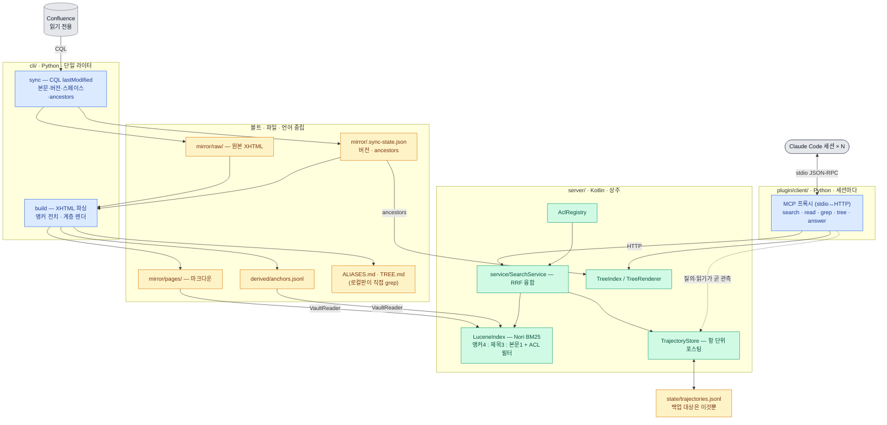

# WikiLens 아키텍처

싱크·빌드 = Python(`cli/`) · 서버 = Kotlin + Lucene/Nori(`server/`) · 인터페이스 = 파일

> 이 문서는 **지금 구현된 것**만 적는다. 제안 단계인 것(임베딩 기반 학습 표현)은
> [`embedding-learning-design.md`](embedding-learning-design.md) 에, 기각된 안과
> 뒤집힌 결정은 [`../DECISIONS.md`](../DECISIONS.md) 에 있다.

## 두 판

**비교표는 [`../README.md`](../README.md#어느-것을-쓰나요) 하나에 둔다** —
같은 표를 두 곳에 두면 갈라진다. 여기서는 아키텍처에만 걸리는 것을 적는다.

- **설정 정본은 양판 공통 `~/.wikilens/`** — 비밀 아닌 것은 `config.json`(볼트 경로 ·
  CLI 경로 · 서버 주소 · 사용자), 토큰류는 `env.sh`(600). 환경변수는 일회성 재정의다(D10).
- **둘 다 켜져 있으면 서버판이 우선한다.** 배타성은 강제할 수단이 없다 — 서버판 MCP
  도구는 스킬 선택과 무관하게 항상 노출된다(D13).
- 로컬판은 검색 경로에 **런타임 의존성이 0** 이다(파일 읽기와 grep 뿐). 그래서 MCP 를
  안 쓴다 — 프로세스 기동이 끼면 파이썬 환경 문제가 검색 실패로 나타난다(D8).

## 컨테이너

## 배포

`&&` 가 중요하다 — 싱크가 실패했는데 재색인이 돌면 절반만 반영된다.

## 책임 분리

| 프로세스 | 언어 | 쓰기 권한 | 실행 |
|---|---|---|---|
| `wikilens sync` / `build` | Python | `mirror/` `derived/` **배타적** | 주기적 |
| 서버 | Kotlin | `state/` **가산 전용** | 상주 |

**파괴적 쓰기를 하는 프로세스는 싱커 하나뿐이다.** 서버는 추가만 하므로 세션 간 조율이
필요 없고, 색인 교체는 스냅샷(검색기+메타+트리) 하나를 원자적으로 스왑한다.

서버는 **볼트를 읽기만 하고, 그것도 두 자리에서만** 한다 — 기동·재색인 때 전량
(`vaultBootstrap`), 그리고 `read`·`grep` 이 요청마다. 후자가 남는 이유는 Lucene 이
본문을 저장하지 않아서다(`Field.Store.NO`) — 색인만으로는 본문을 돌려줄 수 없다.
그래서 `grep` 의 비용은 색인이 아니라 **디스크 스캔**이고(2,383건 0.64초),
10만 규모에서 먼저 깨지는 것 넷 중 하나다(`DECISIONS.md` D12).

## 불변식

| 불변식 | 강제 수단 |
|---|---|
| 페이지 ID가 권위, 제목은 렌더링 | `layout.py` ↔ `vault/Layout.kt` (샤딩 `{뒤2}` — 앞자리는 엔트로피가 낮다) |
| 궤적만 복구 불가 | 포스팅은 궤적의 함수 — 기동 시 로그 재생으로 복원 |
| 위키에 쓰지 않음 | 쓰기 경로 부재를 `shared_contract.sh` 가 검사 |
| 궤적은 요청이 아니라 관측 | 읽기가 서버를 거치므로 훅이 불필요 |
| 권한 없음은 404 (403 아님) | `ContentService.read` 가 null → `Controller` 가 404 |
| 사용자 정규식이 서버를 못 죽임 | `grep` 이 RE2(`com.google.re2j`) — 백트래킹 없음 |
| 경로 의존 질의는 캐싱 안 함 | `Gate.classify` — `LOCALIZATION` 만 간선 생성 |
| 문자 집합 판정은 `build` 한 곳 | `scripts.py` → `derived/excluded.json` → `VaultReader.readExcluded` (서버에 설정 없음) |

## 데이터 흐름

**싱크** — `CQL lastModified` 로 증분 조회 → `mirror/raw/` 에 원본 XHTML +
`.sync-state.json` 에 버전·`ancestors` → `build` 가 전부 받은 뒤 한 번에 파싱
(제목→ID 해석을 완전하게 하려고 단계를 나눴다) → 마크다운 · 앵커 전치
(`anchors.jsonl`) · `ALIASES.md` · `TREE.md`.

**편입 판정** — `build --scripts` 를 주면 그 문자 집합 밖의 문서를 **볼트에서 뺀다**
(다국어 코퍼스용). 파생물 전부에서 빠지고 `mirror/pages/`·`mirror/structure/` 파일도
지운다 — 안 지우면 로컬판이 본문 grep 으로 찾는데 서버판은 못 찾아 **같은 볼트에 두
판이 다른 답을 낸다.** 결정은 `derived/excluded.json` 에 남고 서버는 그것을 읽는다
(서버는 페이지 목록을 `sync` 가 쓴 `.sync-state.json` 에서 얻으므로, 파생물에서 빼는
것만으로는 안 걸러진다). **원본 `raw/` 는 안 지우므로 되돌리기가 재빌드 하나다.**

판정을 서버가 아니라 `build` 에 둔 이유는 **결정이 한 곳이어야 두 판이 같은 문서
집합을 보기** 때문이다 — 서버에 두면 로컬판이 아무것도 못 받는다.

**기본은 꺼짐이고, 효과가 나는 조건이 좁다.** 이 코퍼스에서 켜면 473건(3.4%)이
빠지는데 30질의 랭킹 대조는 상위 10 적중이 16 → 16 으로 안 변했다. G09 에이전트
벤치에서는 **적중이 1/9 → 4/9** 였다(12세션 2/12 → 6/12, p=0.19~0.29). 그런데
G08 로 재현을 시도하니 **기준선이 이미 9/9** 였고 모델은 그 그룹의 오염 문서를 한
번도 열지 않았다. 갈린 것은 **오염 문서가 1위인가**다 — 1위면 모델이 거기서 답을
확정하고 멈추고, 2위면 그냥 지나친다. 그 조건은 30질의에서 1건(3%)이다.
측정은 `experiment-2026-08-18-scripts.md`.

**질의** — 서버가 Nori 로 토큰화(토크나이저 정본은 하나) → Lucene BM25(앵커·제목·본문
가중 + ACL 필터 절) → 같은 항으로 `TrajectoryStore.hints` 조회 → RRF 융합. 학습 힌트는
순위가 아니라 **EB 신뢰도로 가중**한다. 힌트 대상은 `AclRegistry` 로 한 번 더 거른다.

**학습** — `search`/`read` 호출 자체가 관측이다. 질의 스팬에 읽기를 붙여두고, 세션 종료
또는 질의 재구성 시점에 확정 → `trajectories.jsonl` append + `postings[항][목적지]` 갱신.
신뢰도는 Wilson 이 아니라 **검색 점수를 사전분포로 쓰는 EB 하한**이다(D3 에서 뒤집혔다).

**계층** — `ancestors` 는 앵커와 완전히 분리된 신호다. 로컬판은 `TREE.md`, 서버판은
`/api/tree`(`rootId`·`depth` 로 부분 조회). 앵커가 없는 고아 문서에 닿는 유일한 경로다.

## 아직 결정하지 않은 것

- **서버판 신원** — 여기 적혀 있던 셋(권한 미수집 · 관리 API 무인증 · 등록 휘발)은
  전부 만들었다: `wikilens acl` 이 상속까지 풀어 수집하고, `/api/admin` 하위가 경로로
  잠기며(기본이 잠김), 등록은 `acl-users.json` 에 원자적으로 남는다. **남은 것은
  `userKey` 가 자기주장이라는 것**이고, 그건 리버스 프록시(SSO)가 헤더로 신원을
  주입해야 풀린다 — PAT 을 받는 안이 왜 안 되는지는 D22. 그때까지 다중 사용자
  배포는 신뢰 경계 안에 한한다.
- **사람 쪽 권한 갱신** — 페이지 권한은 `wikilens acl` 이 따라가지만 사용자 토큰은
  운영자가 손으로 고친다. 낡는 방향이 "덜 보임" 이 아니라 **"더 보임"** 이다.
- **"유용했다" 판정** — 신호는 다섯이다(마지막 읽기 · 질의 재구성 · 서빙 후 안 읽힌
  힌트 · 지나친 읽기 · `dest` 의 검색 순위). 셋째가 유일하게 학습을 **되돌린다.**
  노이즈 크기는 `pWrong`(거부/서빙)으로만 알 수 있고, `dest = reads.last()` 라는
  전제 자체는 그대로다. 순위 가중의 문턱은 손으로 정한 값이다.
- **검색 랭킹 품질** — 배선은 실데이터로 검증됐지만 랭킹 자체의 품질은 미검증.
  RRF 가중치(`RRF_K`, `LEARNED_WEIGHT`)는 손으로 정한 값이다.
