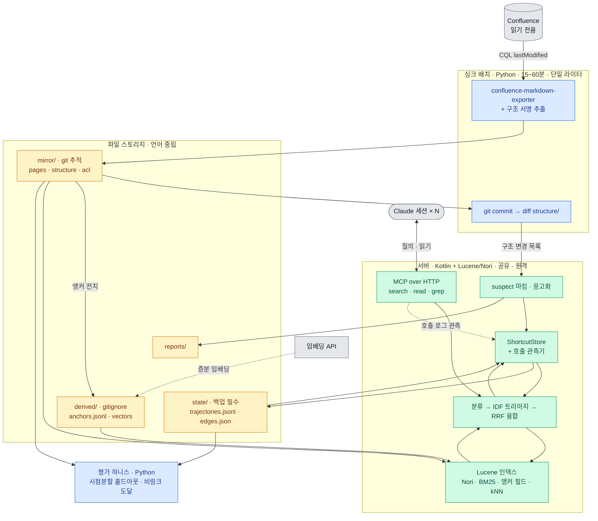
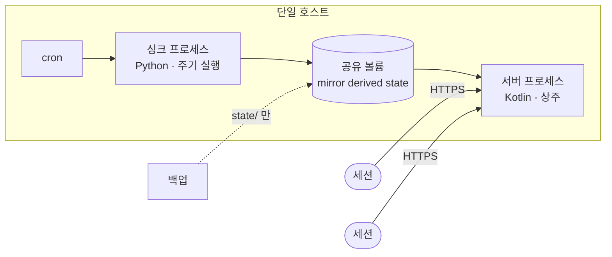

# WikiLens High-Level Architecture

스택 확정: 싱크 = Python · 서버 = Kotlin + Lucene/Nori · 평가 = Python · 인터페이스 = 파일

## 컨테이너 다이어그램

## 배포 형태

## 책임 분리

| 프로세스 | 언어 | 쓰기 권한 | 실행 |
|---|---|---|---|
| 싱크 배치 | Python | `mirror/` `derived/` **배타적** | 주기적 |
| 서버 | Kotlin | `state/` **가산 전용** | 상주 |
| 평가 하니스 | Python | 없음 (읽기 전용) | 수동 |

**파괴적 쓰기를 하는 프로세스는 싱커 하나뿐입니다.** 서버는 추가만 하므로 세션 간 조율이 필요 없고, 인덱스 교체는 참조 원자적 스왑으로 처리합니다.

## 불변식

| 불변식 | 강제 수단 |
|---|---|
| 페이지 ID가 권위, 제목은 렌더링 | `mirror/pages/{id}.md` |
| 구조 변경만 무효화 트리거 | `structure/` 분리 + `git diff` |
| 궤적만 복구 불가 | `state/` 격리, 백업 대상 = 이 디렉터리 |
| 위키에 쓰지 않음 | Confluence 토큰 = 읽기 전용 스코프 |
| 궤적은 요청이 아니라 관측 | 서버가 자기 호출 로그에서 추출 |
| 세션 간 학습 공유 | 서버 원격 · 단일 인스턴스 |

## 데이터 흐름 요약

**싱크** — `CQL lastModified` → 마크다운 + 구조 서명 → git commit → `git diff -- structure/` → 변경분 숏컷 `suspect` 마킹 (삭제 아님) → 앵커 전치 재구축 → 벡터 증분

**질의** — 경로 의존성 분류 → IDF 트리아지 (여기서 `Diffuse`면 비용 0으로 종료) → Lucene BM25 + 앵커 필드 + kNN + 숏컷 포스팅 → RRF → 좌표 + 폴백 경로

**학습** — MCP 호출 로그 관측 → `trajectories.jsonl` append → 목적지 분포별 Wilson 갱신 → `edges.json` 스냅샷

**보고** — 반복 적중 숏컷 승격 → `reports/` → 누락 링크·고아 페이지

## 이 아키텍처가 결정하지 않은 것

- **ACL 시행** — 파일럿은 권한 균일 스페이스로 회피. 공유 서버라 미룰 수 있는 기간이 짧음
- **L2 착수 여부** — 궤적이 쌓이고 비링크 도달 비율을 잰 뒤 판단
- **suspect 임계** — 무효화 후 검증 통과율로 사후 튜닝
