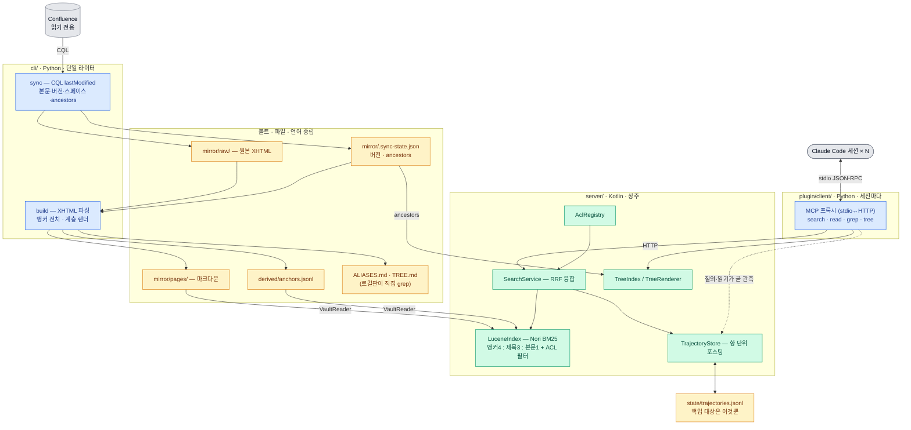
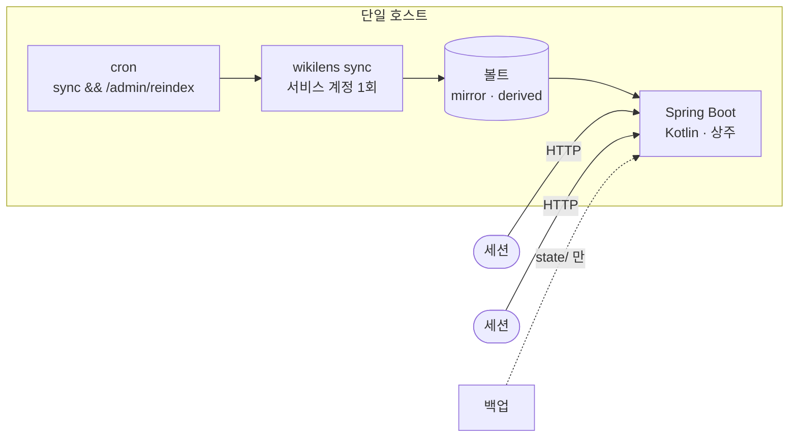

# WikiLens 아키텍처

싱크·빌드 = Python(`cli/`) · 서버 = Kotlin + Lucene/Nori(`server/`) · 인터페이스 = 파일

> 이 문서는 **지금 구현된 것**만 적는다. 제안 단계인 것(임베딩 기반 학습 표현)은
> [`embedding-learning-design.md`](embedding-learning-design.md) 에, 기각된 안과
> 뒤집힌 결정은 [`../DECISIONS.md`](../DECISIONS.md) 에 있다.

## 두 판

| | 로컬판 | 서버판 |
|---|---|---|
| 코퍼스 | 클라이언트 (볼트 전체) | 서버 |
| 검색 | grep + `ALIASES.md`·`TREE.md` | BM25 + Nori + 앵커 + 학습 힌트 |
| 인터페이스 | 스킬 + 커맨드 2개 (`setup`·`sync`) | MCP 도구 4개 |
| ACL | 개인 토큰으로 싱크 (자동) | 질의 시점 시행 (취소 가능) |
| 궤적 관측 | 없음 | 서버가 직접 |
| 설정 정본 | `~/.wikilens/` (config.json · env.sh) | 같음 — `config.json` 의 `server`·`user` |

## 컨테이너

## 배포

`&&` 가 중요하다 — 싱크가 실패했는데 재색인이 돌면 절반만 반영된다.

## 책임 분리

| 프로세스 | 언어 | 쓰기 권한 | 실행 |
|---|---|---|---|
| `wikilens sync` / `build` | Python | `mirror/` `derived/` **배타적** | 주기적 |
| 서버 | Kotlin | `state/` **가산 전용** | 상주 |

**파괴적 쓰기를 하는 프로세스는 싱커 하나뿐이다.** 서버는 추가만 하므로 세션 간 조율이
필요 없고, 색인 교체는 스냅샷(검색기+메타+트리) 하나를 원자적으로 스왑한다.

## 불변식

| 불변식 | 강제 수단 |
|---|---|
| 페이지 ID가 권위, 제목은 렌더링 | `layout.py` ↔ `vault/Layout.kt` (샤딩 `{앞2}/{다음2}`) |
| 궤적만 복구 불가 | 포스팅은 궤적의 함수 — 기동 시 로그 재생으로 복원 |
| 위키에 쓰지 않음 | 쓰기 경로 부재를 `shared_contract.sh` 가 검사 |
| 궤적은 요청이 아니라 관측 | 읽기가 서버를 거치므로 훅이 불필요 |
| 권한 없음은 404 (403 아님) | `ContentService.read` 가 null → `Controller` 가 404 |
| 경로 의존 질의는 캐싱 안 함 | `Gate.classify` — `LOCALIZATION` 만 간선 생성 |

## 데이터 흐름

**싱크** — `CQL lastModified` 로 증분 조회 → `mirror/raw/` 에 원본 XHTML +
`.sync-state.json` 에 버전·`ancestors` → `build` 가 전부 받은 뒤 한 번에 파싱
(제목→ID 해석을 완전하게 하려고 단계를 나눴다) → 마크다운 · 앵커 전치
(`anchors.jsonl`) · `ALIASES.md` · `TREE.md`.

**질의** — 서버가 Nori 로 토큰화(토크나이저 정본은 하나) → Lucene BM25(앵커·제목·본문
가중 + ACL 필터 절) → 같은 항으로 `TrajectoryStore.hints` 조회 → RRF 융합. 학습 힌트는
순위가 아니라 **EB 신뢰도로 가중**한다. 힌트 대상은 `AclRegistry` 로 한 번 더 거른다.

**학습** — `search`/`read` 호출 자체가 관측이다. 질의 스팬에 읽기를 붙여두고, 세션 종료
또는 질의 재구성 시점에 확정 → `trajectories.jsonl` append + `postings[항][목적지]` 갱신.
신뢰도는 Wilson 이 아니라 **검색 점수를 사전분포로 쓰는 EB 하한**이다(D3 에서 뒤집혔다).

**계층** — `ancestors` 는 앵커와 완전히 분리된 신호다. 로컬판은 `TREE.md`, 서버판은
`/api/tree`(`rootId`·`depth` 로 부분 조회). 앵커가 없는 고아 문서에 닿는 유일한 경로다.

## 아직 결정하지 않은 것

- **ACL 수집** — `sync` 가 권한을 안 가져와 모든 페이지가 `@public` 이다.
  다중 사용자 배포 전 필수(CLAUDE.md 우선순위 1).
- **"유용했다" 판정** — 마지막 읽기와 질의 재구성이라는 약한 신호 둘뿐.
  노이즈 크기는 `pWrong` 으로만 알 수 있다.
- **검색 랭킹 품질** — 배선은 실데이터로 검증됐지만 랭킹 자체의 품질은 미검증.
  RRF 가중치(`RRF_K`, `LEARNED_WEIGHT`)는 손으로 정한 값이다.
