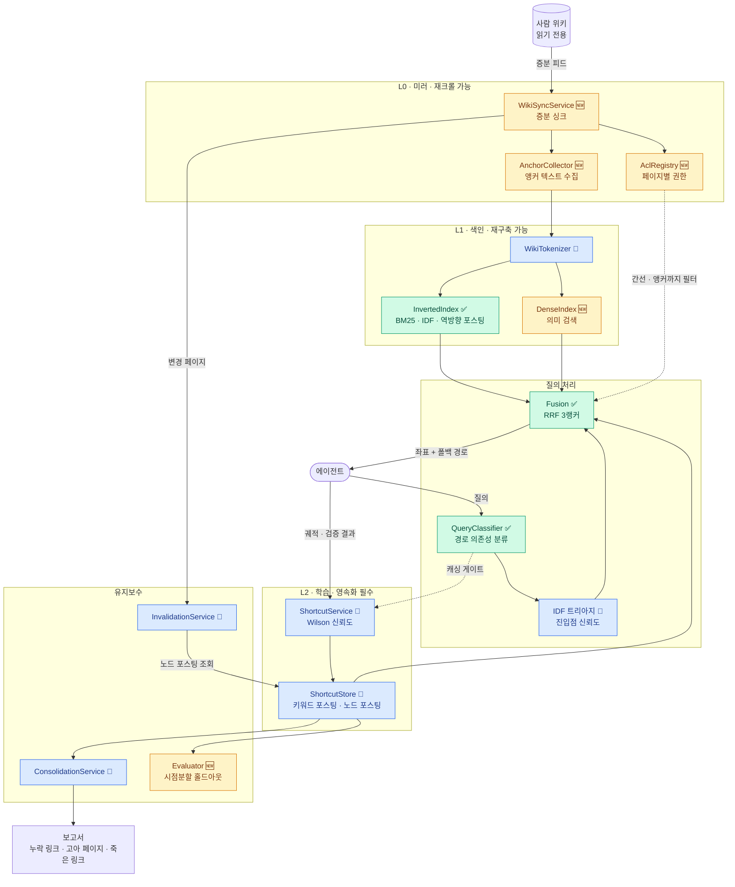
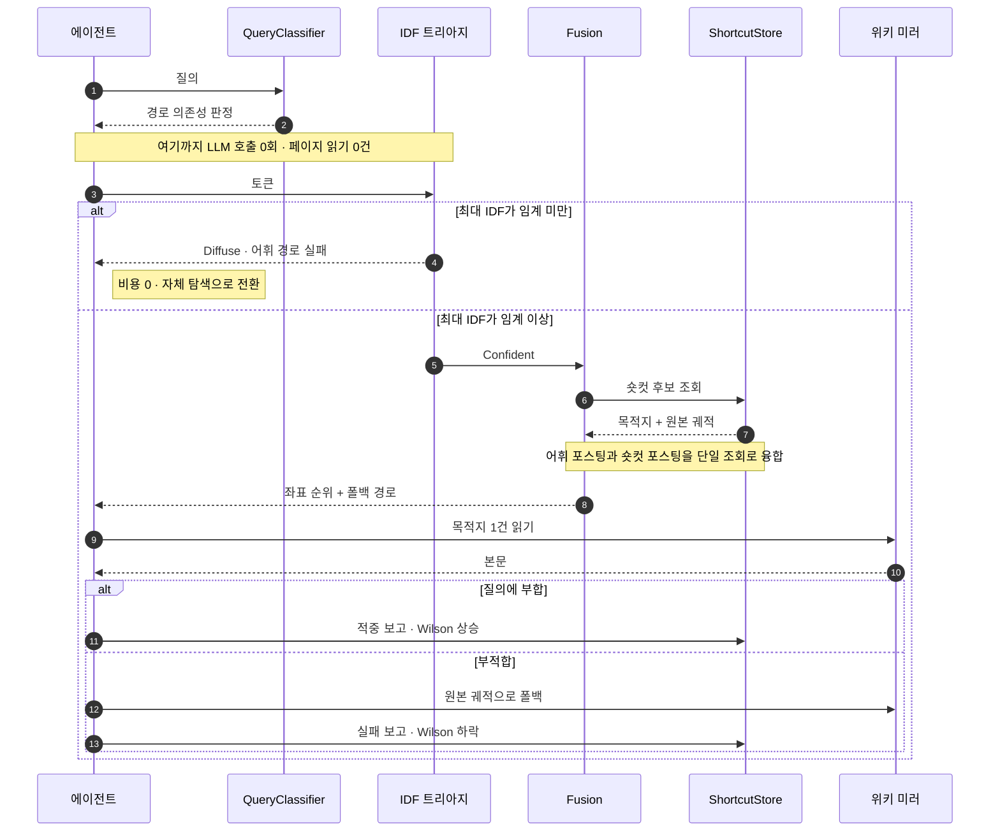
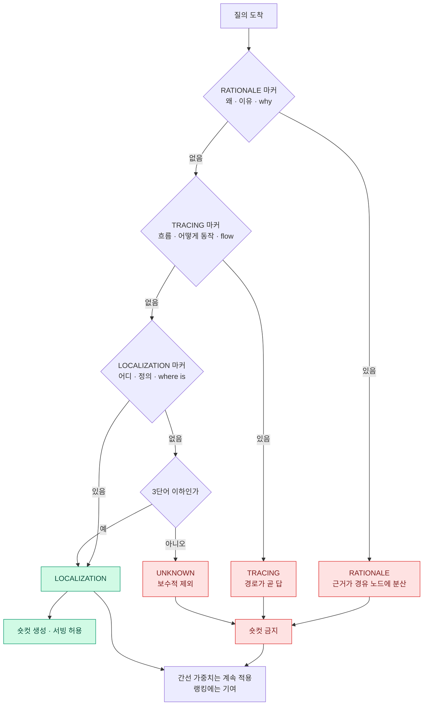
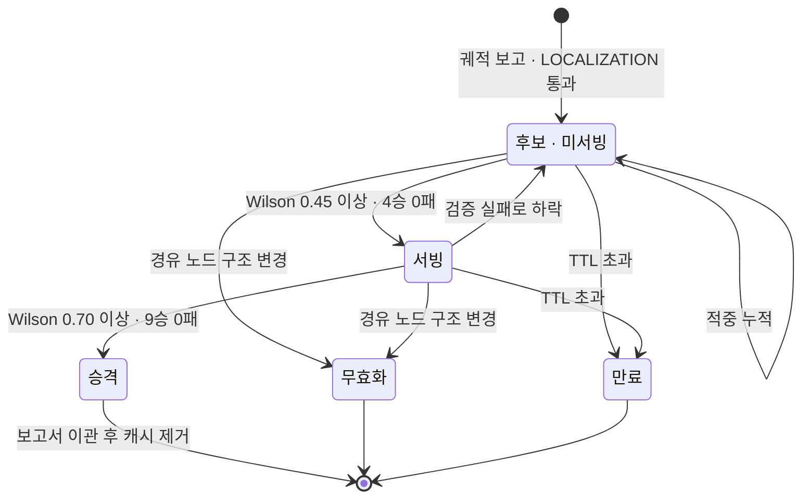
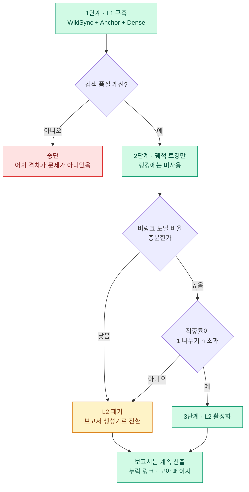

# WikiLens 다이어그램

범례 — ✅ 기존 코드 재사용 · 🔧 수정 필요 · 🆕 신규 구축

## 1. 전체 아키텍처

```mermaid
flowchart TB
    WIKI[("사람 위키<br/>읽기 전용")]
    AGENT(["에이전트"])

    subgraph L0["L0 · 미러 · 재크롤 가능"]
        SYNC["WikiSyncService 🆕<br/>증분 싱크"]
        ANCHOR["AnchorCollector 🆕<br/>앵커 텍스트 수집"]
        ACLR["AclRegistry 🆕<br/>페이지별 권한"]
    end

    subgraph L1["L1 · 색인 · 재구축 가능"]
        TOK["WikiTokenizer 🔧"]
        BM25["InvertedIndex ✅<br/>BM25 · IDF · 역방향 포스팅"]
        DENSE["DenseIndex 🆕<br/>의미 검색"]
    end

    subgraph QRY["질의 처리"]
        CLS["QueryClassifier ✅<br/>경로 의존성 분류"]
        TRI["IDF 트리아지 🔧<br/>진입점 신뢰도"]
        FUS["Fusion ✅<br/>RRF 3랭커"]
    end

    subgraph L2["L2 · 학습 · 영속화 필수"]
        SVC["ShortcutService 🔧<br/>Wilson 신뢰도"]
        STORE["ShortcutStore 🔧<br/>키워드 포스팅 · 노드 포스팅"]
    end

    subgraph MNT["유지보수"]
        INV["InvalidationService 🔧"]
        CON["ConsolidationService 🔧"]
        EVAL["Evaluator 🆕<br/>시점분할 홀드아웃"]
    end

    REPORT["보고서<br/>누락 링크 · 고아 페이지 · 죽은 링크"]

    WIKI -->|증분 피드| SYNC
    SYNC --> ANCHOR
    SYNC --> ACLR
    ANCHOR --> TOK
    TOK --> BM25
    TOK --> DENSE

    AGENT -->|질의| CLS
    CLS --> TRI
    TRI --> FUS
    BM25 --> FUS
    DENSE --> FUS
    STORE --> FUS
    ACLR -.->|간선 · 앵커까지 필터| FUS
    FUS -->|"좌표 + 폴백 경로"| AGENT

    AGENT -->|궤적 · 검증 결과| SVC
    CLS -.->|캐싱 게이트| SVC
    SVC --> STORE

    SYNC -->|변경 페이지| INV
    INV -->|노드 포스팅 조회| STORE
    STORE --> CON
    CON --> REPORT
    STORE --> EVAL

    classDef isNew fill:#fef3c7,stroke:#d97706,color:#78350f
    classDef isMod fill:#dbeafe,stroke:#2563eb,color:#1e3a8a
    classDef isOk fill:#d1fae5,stroke:#059669,color:#064e3b
    class SYNC,ANCHOR,ACLR,DENSE,EVAL isNew
    class TOK,TRI,SVC,STORE,INV,CON isMod
    class BM25,CLS,FUS isOk
```

## 2. 조회 경로

```mermaid
sequenceDiagram
    autonumber
    participant A as 에이전트
    participant C as QueryClassifier
    participant T as IDF 트리아지
    participant F as Fusion
    participant S as ShortcutStore
    participant W as 위키 미러

    A->>C: 질의
    C-->>A: 경로 의존성 판정

    Note over A,T: 여기까지 LLM 호출 0회 · 페이지 읽기 0건

    A->>T: 토큰
    alt 최대 IDF가 임계 미만
        T-->>A: Diffuse · 어휘 경로 실패
        Note right of A: 비용 0 · 자체 탐색으로 전환
    else 최대 IDF가 임계 이상
        T->>F: Confident
        F->>S: 숏컷 후보 조회
        S-->>F: 목적지 + 원본 궤적
        Note over F,S: 어휘 포스팅과 숏컷 포스팅을 단일 조회로 융합
        F-->>A: 좌표 순위 + 폴백 경로

        A->>W: 목적지 1건 읽기
        W-->>A: 본문
        alt 질의에 부합
            A->>S: 적중 보고 · Wilson 상승
        else 부적합
            A->>W: 원본 궤적으로 폴백
            A->>S: 실패 보고 · Wilson 하락
        end
    end
```

## 3. 경로 의존성 게이트

숏컷 점프와 간선 가중치를 분리하는 것이 핵심. 현재 구현은 이 둘을 함께 막고 있어 수정 대상.

```mermaid
flowchart TD
    Q["질의 도착"] --> R{"RATIONALE 마커<br/>왜 · 이유 · why"}
    R -->|있음| N1["RATIONALE<br/>근거가 경유 노드에 분산"]
    R -->|없음| T{"TRACING 마커<br/>흐름 · 어떻게 동작 · flow"}
    T -->|있음| N2["TRACING<br/>경로가 곧 답"]
    T -->|없음| L{"LOCALIZATION 마커<br/>어디 · 정의 · where is"}
    L -->|있음| Y["LOCALIZATION"]
    L -->|없음| S{"3단어 이하인가"}
    S -->|예| Y
    S -->|아니오| N3["UNKNOWN<br/>보수적 제외"]

    Y --> G1["숏컷 생성 · 서빙 허용"]
    N1 --> G2["숏컷 금지"]
    N2 --> G2
    N3 --> G2
    G2 --> G3["간선 가중치는 계속 적용<br/>랭킹에는 기여"]
    Y --> G3

    classDef allow fill:#d1fae5,stroke:#059669,color:#064e3b
    classDef deny fill:#fee2e2,stroke:#dc2626,color:#7f1d1d
    class Y,G1 allow
    class N1,N2,N3,G2 deny
```

## 4. 숏컷 생애주기

```mermaid
stateDiagram-v2
    state "후보 · 미서빙" as CAND
    state "서빙" as SERVE
    state "승격" as PROMO
    state "무효화" as INVAL
    state "만료" as EXPIRE

    [*] --> CAND: 궤적 보고 · LOCALIZATION 통과
    CAND --> CAND: 적중 누적
    CAND --> SERVE: Wilson 0.45 이상 · 4승 0패
    SERVE --> CAND: 검증 실패로 하락
    SERVE --> PROMO: Wilson 0.70 이상 · 9승 0패
    PROMO --> [*]: 보고서 이관 후 캐시 제거
    CAND --> INVAL: 경유 노드 구조 변경
    SERVE --> INVAL: 경유 노드 구조 변경
    CAND --> EXPIRE: TTL 초과
    SERVE --> EXPIRE: TTL 초과
    INVAL --> [*]
    EXPIRE --> [*]
```

## 5. 구축 순서와 실패 분기

```mermaid
flowchart TD
    P1["1단계 · L1 구축<br/>WikiSync + Anchor + Dense"] --> M1{"검색 품질 개선?"}
    M1 -->|아니오| X1["중단<br/>어휘 격차가 문제가 아니었음"]
    M1 -->|예| P2["2단계 · 궤적 로깅만<br/>랭킹에는 미사용"]
    P2 --> M2{"비링크 도달 비율<br/>충분한가"}
    M2 -->|낮음| B1["L2 폐기<br/>보고서 생성기로 전환"]
    M2 -->|높음| M3{"적중률이<br/>1 나누기 n 초과"}
    M3 -->|아니오| B1
    M3 -->|예| P3["3단계 · L2 활성화"]

    B1 --> R["보고서는 계속 산출<br/>누락 링크 · 고아 페이지"]
    P3 --> R

    classDef good fill:#d1fae5,stroke:#059669,color:#064e3b
    classDef bad fill:#fee2e2,stroke:#dc2626,color:#7f1d1d
    classDef mid fill:#fef3c7,stroke:#d97706,color:#78350f
    class P1,P2,P3,R good
    class X1 bad
    class B1 mid
```
