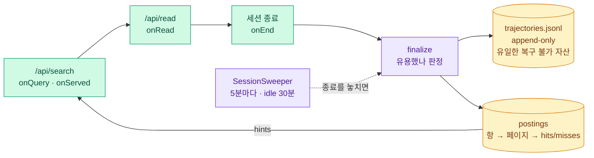

# 학습 레이어 (서버판만)

> 이 문서는 `README.md` 에서 옮겨 왔습니다(2026-08-27). README 는 "무엇을 하나" 만
> 남기고, 어떻게 관측하고 무엇을 조심하는지는 여기 둡니다.

"남들이 같은 질문으로 찾아간 문서"를 다음 사람에게 밀어 올립니다.

어휘 검색이 못 찾은 것을 사람들의 탐색이 대신 찾아준 셈이니, 그 경로를 기억해 두는 것입니다.

층 넷 중 가장 조건이 까다롭습니다. 같은 질의가 반복돼야 하고, 서버가 있어야 하고,
사람이 여럿이어야 합니다. 혼자서는 통계가 안 쌓입니다.

이 개발 코퍼스에서는 아직 궤적이 0 입니다.
**아래는 만들어 둔 것이지 검증된 것이 아닙니다.**

### 관측 — 도구 호출이 곧 궤적입니다



| 안 만든 것 | 대신 | 왜 |
|---|---|---|
| 보고 도구(`record_trajectory`) | 검색·읽기 **자체를 관측** | 에이전트가 안정적으로 불러줄 리 없습니다 (D6) |
| 클라이언트 훅 | 서버가 직접 봄 | 읽기가 서버를 거칩니다 |
| 세션 경계 조립 | MCP 프록시 프로세스 하나 = 세션 하나 | 종료를 놓치면(SIGKILL·크래시) `SessionSweeper` 가 거둡니다 — **안 거두면 그 세션이 배운 것이 통째로 사라집니다** |

### 무엇을 기억하나

| | 값 | 왜 |
|---|---|---|
| 키 단위 | **항(term)** — 키워드 집합이 아님 | "로그인 붙이는 법 어디"와 "로그인 붙이는 법"이 다른 키가 되면 카운트가 흩어집니다 |
| 저장 형태 | `항 → 페이지 → (hits, misses)` | 같은 항에 목적지가 여럿인 건 경쟁이 아니라 **질의가 모호한 것**이라 분포로 둡니다 |
| 캐싱 대상 | `LOCALIZATION` 질의만 | "이 데이터가 어떻게 흐르나"에 목적지만 주면 답한 게 아니라 **답을 지운** 겁니다 |

`Gate.classify` 가 질의를 넷으로 나누고 **첫째만 간선을 만듭니다:**

| 종류 | 답이 어디 있나 | 간선 |
|---|---|---|
| `LOCALIZATION` | 목적지가 곧 답 | **만듭니다** |
| `TRACING` | 경로가 곧 답 | 안 만듭니다 — 목적지만 주면 답을 지운 것 |
| `RATIONALE` | 근거가 경유지에 분산 | 안 만듭니다 |
| `UNKNOWN` | 판단 보류 | 안 만듭니다 |

분포는 `/api/stats` 의 `byKind` 가 냅니다.

**UNKNOWN 이 아주 낮으면 게이트가 사실상 항등함수**라는 뜻입니다.
그 수를 보기 전에는 이 분류가 일하는지 알 수 없습니다.

### 얼마나 믿나 — Empirical Bayes

Wilson 하한이 아닙니다.

Wilson 은 카운트만 봅니다. **같은 4승 3패라도 검색이 강하게 가리키는 후보와 겨우
걸린 후보를 구분하지 못합니다.**

신뢰도가 0.45 미만이면 서빙하지 않습니다. 확신 없을 때 침묵하는 것이 이 설계의
전제입니다.

<details>
<summary><b>식과 문턱</b> — Beta 사후분포 · 손익분기</summary>

```
prior = Beta(s·κ, (1−s)·κ)          s = 정규화된 Lucene 점수 · κ = 5
post  = Beta(s·κ + hits, (1−s)·κ + misses)
신뢰도 = 그 사후분포의 5% 하한
```

Wilson 은 **균등 사전분포의 특수한 경우**입니다. 검색 점수를 사전분포로 주면 그 정보가
살아납니다.

표본이 쌓이면 사전분포 영향은 저절로 사라집니다 (400승 300패에서 격차 0.005).

사전확률은 `[0.05, 0.85]` 로 자릅니다. 1.0 이면 Beta 한쪽 모수가 0 이 되어
**관측 한 번에 신뢰도 1.0** 이 됩니다.

```
손익분기    p_hit · (n−1) > p_wrong
```

기준이 절대 적중률이 아니라 **적중 대 오답 비율**입니다.

캐시가 침묵하면 `p_wrong → 0` 이라 거의 항상 이득입니다. `1/n` 은 틀린 공식입니다 (D2).

</details>

### "유용했다"는 어떻게 아나 — 이 설계의 최대 미해결

서버는 무엇을 읽었는지만 보고 그게 답이었는지는 모릅니다.

신호 다섯을 씁니다.

| 신호 | 판정 |
|---|---|
| **모델이 `answer` 로 지정한 페이지** | 답이다 — 추정이 아니라 진술입니다 |
| 마지막으로 읽은 페이지 | 진술이 없을 때의 폴백 — 탐색은 성공에서 멈춥니다 |
| 키워드가 겹치는 재질의 | 앞 시도는 실패였다 |
| **서빙했는데 끝내 안 읽힌 힌트** | 그 힌트가 틀렸다 — 유일하게 학습을 **되돌리는** 신호 |
| 마지막 읽기 앞의 것들 | 열어보고 지나쳤다 (1건이면 미스 0, 6건이면 5) |
| `dest` 의 검색 순위 | 깊을수록 강한 증거 (1위 ×1 · 2~3위 ×2 · 그 아래 ×3) |

첫째가 나머지 넷의 기준점입니다. `dest` 를 잘못 잡으면 셋이 함께 틀립니다.
어느 문서에 간선을 걸지, 무엇을 "지나쳤다" 로 볼지, 순위 가중을 얼마로 줄지가 전부
거기 걸려 있기 때문입니다. 그래서 추정하는 대신 모델에게 물어봅니다: 답을 전하기 직전에
`answer(pageId)` 를 부르면 그것이 `dest` 가 됩니다. **안 불러도 동작은 같고**
(마지막 읽기로 폴백), 진술이 실제로 오는지는 `/api/stats` 의 `declaredDest` 로 봅니다.

넷째가 중요합니다. 그전에는 미스가 나는 경로가 재질의 하나뿐이라 **엉뚱한 힌트도
벌점이 없었고**, `pWrong` 이 늘 0.0 이었습니다.

클릭 없는 종료를 실패로 세지 않습니다. 결과 제목만 보고 답했을 수 있기 때문입니다.

IR 에서 [good abandonment](https://dl.acm.org/doi/10.1145/1571941.1571951) 로 알려진
오독입니다. `abandonedWithHints` 로 따로 셉니다.

> **아직 재지 못한 것:** 순위 가중의 문턱(3·6)과 3배 상한은 손으로 정한 값입니다.
> 깊을수록 강하다는 방향만 웹 검색 클릭 모델에서 확립된 것이고, 이 코퍼스에서
> 측정하지 않았습니다. 진술이 없을 때의 폴백(`dest = reads.last()`)도 그대로이고,
> **진술이 맞다는 보장도 없습니다.** 모델이 오답을 확신하면 그 오답이 `dest` 가
> 됩니다. 그건 미스 벌점이 잡을 몫입니다.
> `/api/stats` 의 `pWrong` 과 `sinceStart` 로 모니터링하세요.
>
> **폴백이 얼마나 틀리는지는 이제 서버가 셉니다** — `fallbackAgreeRate`. 진술이 있는
> 궤적에서 `reads.last()` 가 같은 답을 골랐는지를 대조한 값입니다. 남은 수와
> 기각한 안은 [`usefulness-signals.md`](usefulness-signals.md).

### 검색 결과에 어떻게 섞이나

어휘 순위와 학습 힌트를 RRF 로 융합합니다.

다만 **힌트는 순위가 아니라 신뢰도로 가중**합니다. EB 하한은 이미 확률이라 순위로
뭉개면 보정된 정보를 버리게 됩니다.

```
어휘   1 / (60 + rank + 1)
학습   1.6 × 신뢰도 / (60 + rank + 1)
```

결과에 붙는 표시가 그것입니다. `*` 는 양쪽에서, `S` 는 학습에서만 나온 것입니다.

`S` 가 곧 **어휘 검색이 못 찾은 문서를 학습이 찾아낸 경우**이고, 이 레이어의 존재
이유입니다.

권한 관문은 `hints()` 술어 하나입니다. 학습 레이어는 권한을 모르므로 술어를 밖에서
받아 **자르기 전에** 거릅니다.

`take` 뒤에 거르면 서빙 못 할 후보가 슬롯을 먹어, 볼 수 있는 힌트가 아래에 있어도
안 나옵니다. 같은 실패를 자리만 바꿔 세 번 겪었습니다.

---
