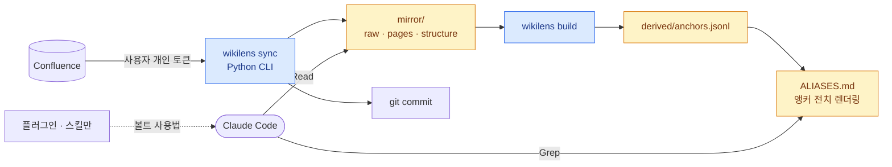
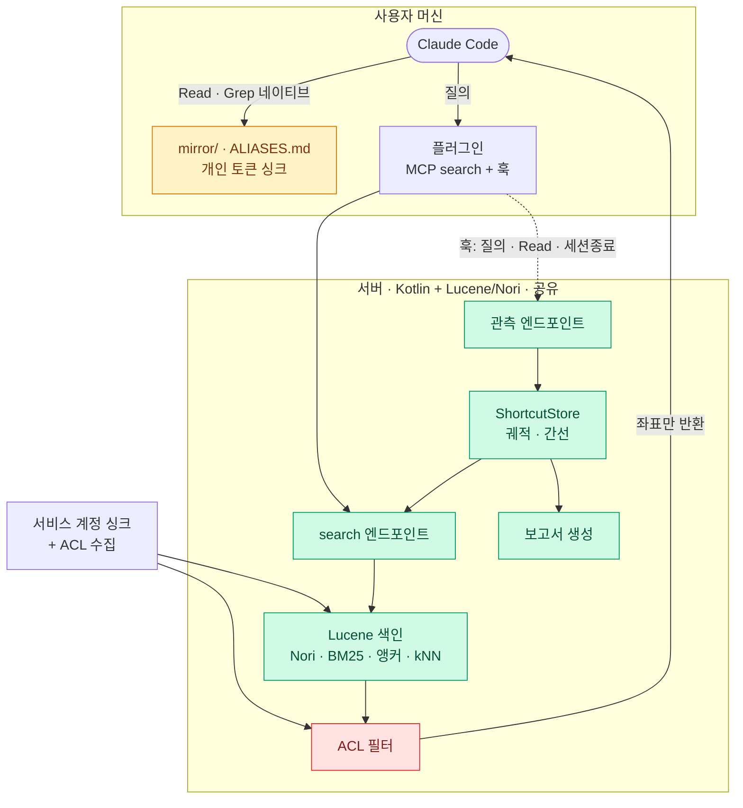

# WikiLens — 로컬판 / 서버판

두 제품으로 분리한다. 공통 기반은 **싱크 CLI와 파일 계약**뿐이고, 그 위는 완전히 다르다.

---

## 0. 공통 기반 — 지금 확정해야 할 것

두 판이 공유하는 유일한 인터페이스. 여기만 고정하면 나중에 갈라져도 호환된다.

```
mirror/
  raw/{sh}/{ard}/{id}.xhtml     ← Confluence 원본. 무손실. 권위
  pages/{sh}/{ard}/{id}.md      ← 파생. 사람·grep·diff용
  structure/{sh}/{ard}/{id}.json ← 파생. 무효화 판정용
  .sync-state.json
derived/
  anchors.jsonl                  ← 앵커 전치
```

`{sh}/{ard}` = 페이지 ID 앞 4자리 샤딩 (`123456789` → `12/34/`).

**`anchors.jsonl` 스키마** — 이게 가장 중요한 계약이다.

```jsonl
{"target":"123456789",
 "title":"OAuth 2.0 인가 코드 흐름",
 "path":"mirror/pages/12/34/123456789.md",
 "anchors":[{"text":"로그인 방식","from":"987654321"},
            {"text":"SSO 연동","from":"555666777"}],
 "indeg":12}
```

`path`를 포함하는 이유는 로컬판이 샤딩 경로를 계산하지 않고 바로 열 수 있게 하기 위해서다.

**`structure/{id}.json`** — 결정적 직렬화 필수. 키 정렬, 링크 배열 정렬, 고정 구분자.
아니면 `git diff`가 매 싱크마다 전부 변경으로 잡힌다.

```json
{"title":"OAuth 2.0 인가 코드 흐름",
 "headings":["개요","흐름도","토큰 갱신"],
 "links":[{"to":"987654321","anchor":"로그인 방식"}]}
```

---

## 1. 로컬판 — 서버 없음



**핵심은 앵커 전치를 grep 가능한 파일로 물질화하는 것.**

```markdown
## OAuth 2.0 인가 코드 흐름
경로: mirror/pages/12/34/123456789.md
별칭: 로그인 방식 · SSO 연동 · 인증 붙이는 법 · 토큰 받아오기
```

"로그인 붙이는 법"으로 grep하면 이 줄이 걸리고, 경로가 바로 옆에 있다.
제목에는 그 표현이 한 번도 안 나오는데도 찾아진다 — 벤치마크에서 가치의
대부분이 여기 있다고 나온 그 신호가 파일 하나로 끝난다.

**플러그인은 스킬만 담는다.** MCP 서버도 훅도 없다. 볼트 레이아웃과
"먼저 ALIASES.md를 grep하라"는 사용법만 알려주면 된다.

| | |
|---|---|
| 구성 | Python CLI + 생성 파일 + 스킬 전용 플러그인 |
| 검색 | 네이티브 grep. IDF 랭킹 없음 |
| **ACL** | **개인 토큰으로 싱크 → 자동 해결** |
| L2 | 없음 |
| 구축 | 며칠 |

포기하는 것: IDF 트리아지, dense 검색, 세션 간 학습.
마지막 건 손실이 아니다 — 1인 워밍업은 어차피 트래픽 50% 커버에 38일 걸린다.

---

## 2. 서버판 — 로컬판 위에 얹음

로컬판을 **대체하지 않고 증강한다.** 볼트와 네이티브 grep은 그대로 두고,
서버는 계산이 필요한 것만 맡는다.



**읽기는 여전히 로컬이다.** 서버는 좌표만 반환하고, 에이전트는 자기 볼트에서
네이티브로 읽는다. 훅이 그 읽기를 관측하므로 궤적은 완전하다.

이것이 이전에 미해결로 둔 "볼트 대 MCP 경쟁" 문제의 해답이다.
경쟁시키지 않고 **역할을 나눈다** — 서버는 랭킹, 로컬은 읽기, 훅은 관측.

| | |
|---|---|
| 추가되는 것 | IDF 트리아지 · RRF 융합 · L2 · 보고서 |
| MCP 도구 | **`search` 하나.** read/grep은 네이티브라 불필요 |
| 훅 | `UserPromptSubmit` · `PostToolUse(Read\|Grep)` · `SessionEnd` |
| **ACL** | **정면 대응 필요.** 최대 미해결 항목 |
| 구축 | 몇 주 |

### ACL 구조

서버는 서비스 계정으로 전체를 색인하되 **질의 시점에 요청자 권한으로 필터링**한다.
필터 대상이 문서만이 아니라 **간선과 앵커 텍스트까지**여야 한다 — 페이지를 못 열어도
제목이 노출되면 유출이고, 숏컷의 존재 자체가 정보다.

사용자 볼트는 개인 토큰으로 싱크되므로 이미 필터링돼 있다. 따라서
**ACL 필터가 옳게 동작하면 서버가 반환한 ID는 항상 사용자 볼트에 존재한다.**
불일치가 발생하면 그 자체가 ACL 버그의 탐지 신호가 된다.

주의: **권한 변경은 `lastModified`를 건드리지 않는다.** ACL 싱크를 콘텐츠 싱크와
분리해 더 자주 돌려야 한다.

---

## 3. 비교

| | 로컬판 | 서버판 |
|---|---|---|
| 배포 | CLI 설치 | 호스트 운영 + 플러그인 |
| ACL | 자동 해결 | **미해결 · 정면 대응** |
| 랭킹 | grep 순서 | BM25 + 앵커 + dense RRF |
| 진입점 신뢰도 | 없음 | IDF 트리아지 |
| 세션 간 학습 | 없음 | L2 (20명이면 2일 워밍업) |
| 보고서 | 없음 | 누락 링크 · 고아 페이지 |
| 실패 시 잔존물 | 볼트 자체가 유용 | 로컬판으로 강등 |
| 구축 기간 | 며칠 | 몇 주 |

---

## 4. 순서

1. **로컬판 출시.** 실제로 쓰이는지 본다
2. 안 쓰이면 **중단** — 어휘 격차가 실제 문제가 아니었다는 뜻
3. 쓰이면 사용자에게 묻는다: *"찾은 걸 서로 공유하면 도움이 될까요?"*
4. 그 답이 서버판의 존재 이유. 지금 추측하지 않는다

로컬판은 실패해도 죽지 않는다. 볼트와 `ALIASES.md`는 사람이 직접 봐도 쓸모가 있다.
